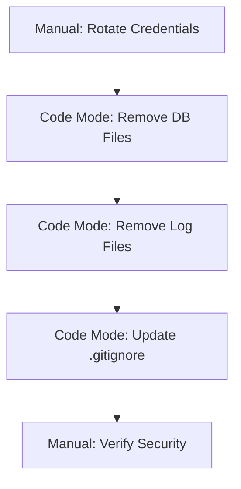
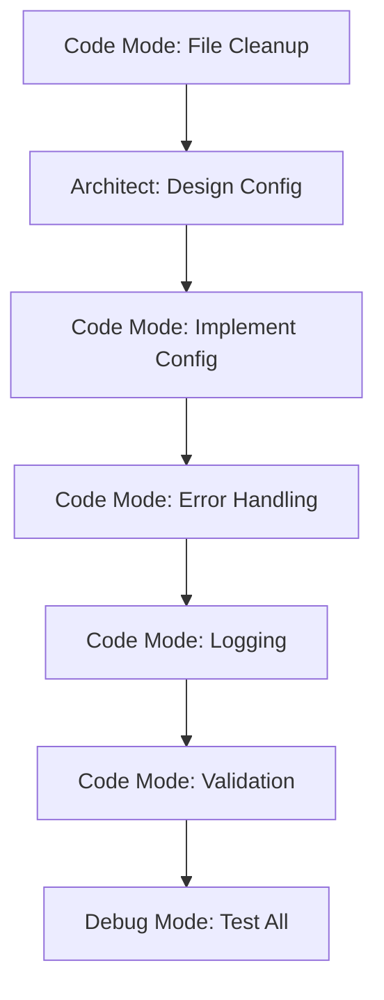
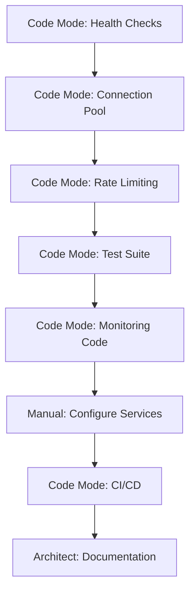
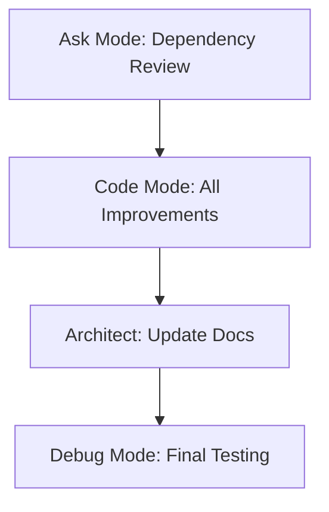

# Mode Delegation Guide for TeenCivics Code Quality Improvements
**Date:** October 1, 2025  
**Purpose:** Guide for delegating tasks to appropriate Roo Cline modes

---

## Overview

This guide helps determine which Roo Cline mode should handle each task from the implementation plan. Different modes have different strengths and file access restrictions.

---

## Mode Capabilities Summary

### 🏗️ Architect Mode
**Best for:** Planning, analysis, documentation, system design  
**File restrictions:** Can only edit `.md` files  
**Strengths:**
- Strategic planning
- System architecture design
- Documentation creation
- Code analysis and review
- Creating implementation plans

**Use when:**
- Planning multi-step changes
- Designing new features
- Creating documentation
- Analyzing code quality
- Breaking down complex tasks

---

### 💻 Code Mode
**Best for:** Implementation, refactoring, bug fixes  
**File restrictions:** Can edit all code files  
**Strengths:**
- Writing and modifying code
- Implementing features
- Refactoring
- Bug fixes
- File operations (create, delete, move)

**Use when:**
- Implementing planned changes
- Refactoring code
- Creating new modules
- Fixing bugs
- Modifying configuration files

---

### 🪲 Debug Mode
**Best for:** Troubleshooting, investigating issues  
**File restrictions:** Can edit all code files  
**Strengths:**
- Systematic debugging
- Adding logging
- Analyzing stack traces
- Identifying root causes
- Testing fixes

**Use when:**
- Investigating errors
- Adding debug logging
- Testing error conditions
- Analyzing failures
- Verifying fixes

---

### ❓ Ask Mode
**Best for:** Questions, explanations, recommendations  
**File restrictions:** Read-only  
**Strengths:**
- Explaining concepts
- Analyzing code
- Providing recommendations
- Answering questions
- Code reviews

**Use when:**
- Need clarification
- Want code explanation
- Seeking recommendations
- Learning about codebase
- Getting second opinion

---

## Task Delegation Matrix

### 🔴 Phase 1: Critical Security Issues

| Task | Recommended Mode | Rationale | Alternative |
|------|-----------------|-----------|-------------|
| **1.1: Secure API Credentials** | **Manual** | Security-sensitive, requires external actions | N/A |
| **1.2: Remove Legacy Database Files** | **Code Mode** | File operations, git commands | N/A |
| **1.3: Remove Sensitive Log Files** | **Code Mode** | File operations, code modifications | N/A |

**Workflow for Phase 1:**
1. **Manual:** Rotate credentials (Task 1.1)
2. **Code Mode:** Remove database files (Task 1.2)
3. **Code Mode:** Remove log files and update logging (Task 1.3)

---

### 🟠 Phase 2: High Priority Cleanup

| Task | Recommended Mode | Rationale | Alternative |
|------|-----------------|-----------|-------------|
| **2.1: Consolidate Test Files** | **Code Mode** | File operations, code merging | Debug Mode (for testing) |
| **2.2: Remove Redundant Scripts** | **Code Mode** | File operations, documentation | N/A |
| **2.3: Remove Obsolete Files** | **Code Mode** | File operations | N/A |
| **2.4: Centralized Configuration** | **Code Mode** | New module creation, refactoring | Architect (for design) |
| **2.5: Improve Error Handling** | **Code Mode** | Code modifications, new classes | Debug Mode (for testing) |
| **2.6: Centralize Logging** | **Code Mode** | Code modifications, refactoring | N/A |
| **2.7: Fix Environment Loading** | **Code Mode** | Code modifications | N/A |
| **2.8: Add Input Validation** | **Code Mode** | New schemas, code modifications | N/A |

**Workflow for Phase 2:**
1. **Architect Mode:** Review and refine configuration design (Task 2.4)
2. **Code Mode:** Implement all tasks in sequence
3. **Debug Mode:** Test error handling and validation (Tasks 2.5, 2.8)

---

### 🟡 Phase 3: Medium Priority Improvements

| Task | Recommended Mode | Rationale | Alternative |
|------|-----------------|-----------|-------------|
| **3.1: Health Check Endpoints** | **Code Mode** | New endpoints, implementation | N/A |
| **3.2: Connection Pooling** | **Code Mode** | Database code modifications | Debug Mode (for testing) |
| **3.3: Rate Limiting** | **Code Mode** | New middleware, configuration | N/A |
| **3.4: Consolidate Test Suite** | **Code Mode** | Test organization, new tests | Debug Mode (for debugging tests) |
| **3.5: Monitoring/Alerting** | **Code Mode + Manual** | Code changes + external setup | N/A |
| **3.6: Improve CI/CD** | **Code Mode** | Workflow file modifications | N/A |
| **3.7: Add Documentation** | **Architect Mode** | Documentation creation | Code Mode (for inline docs) |

**Workflow for Phase 3:**
1. **Code Mode:** Implement technical tasks (3.1-3.6)
2. **Architect Mode:** Create documentation (3.7)
3. **Debug Mode:** Test and verify implementations
4. **Manual:** Configure external services (Sentry, monitoring)

---

### 🟢 Phase 4: Low Priority Improvements

| Task | Recommended Mode | Rationale | Alternative |
|------|-----------------|-----------|-------------|
| **4.1: Code Style/Formatting** | **Code Mode** | Configuration, formatting | N/A |
| **4.2: Dependency Management** | **Code Mode** | Requirements files, auditing | Ask Mode (for recommendations) |
| **4.3: Static File Optimization** | **Code Mode** | File operations, optimization | N/A |
| **4.4: Template Improvements** | **Code Mode** | Template modifications | N/A |
| **4.5: Update .env.example** | **Code Mode** | File modification | Architect Mode (for documentation) |

**Workflow for Phase 4:**
1. **Ask Mode:** Get recommendations on dependencies (Task 4.2)
2. **Code Mode:** Implement all improvements
3. **Architect Mode:** Update documentation as needed

---

## Detailed Task Delegation

### Critical Tasks Requiring Manual Intervention

These tasks **CANNOT** be delegated to any mode and require human action:

1. **Rotating API Credentials (Task 1.1)**
   - Access to external service dashboards
   - Security-sensitive operations
   - Verification of credential rotation

2. **Configuring External Services (Task 3.5)**
   - Sentry account setup
   - Prometheus/Grafana configuration
   - Alert configuration

3. **GitHub Secrets Management**
   - Adding secrets to repository
   - Configuring organization secrets
   - Managing access permissions

---

### Tasks Best Suited for Code Mode

**File Operations:**
- Task 1.2: Remove Legacy Database Files
- Task 1.3: Remove Sensitive Log Files
- Task 2.1: Consolidate Test Files
- Task 2.2: Remove Redundant Scripts
- Task 2.3: Remove Obsolete Files

**Implementation:**
- Task 2.4: Centralized Configuration
- Task 2.5: Improve Error Handling
- Task 2.6: Centralize Logging
- Task 2.7: Fix Environment Loading
- Task 2.8: Add Input Validation
- Task 3.1: Health Check Endpoints
- Task 3.2: Connection Pooling
- Task 3.3: Rate Limiting
- Task 3.4: Consolidate Test Suite
- Task 3.6: Improve CI/CD
- Task 4.1: Code Style/Formatting
- Task 4.2: Dependency Management
- Task 4.3: Static File Optimization
- Task 4.4: Template Improvements
- Task 4.5: Update .env.example

**Why Code Mode:**
- Can create, modify, and delete files
- Can implement complex refactoring
- Can run commands and verify changes
- Can handle multi-file changes

---

### Tasks Best Suited for Architect Mode

**Documentation:**
- Task 3.7: Add Documentation
  - API documentation
  - Architecture diagrams
  - Deployment guide
  - README updates

**Planning:**
- Pre-implementation design for Task 2.4 (Configuration)
- System architecture documentation
- Creating detailed implementation plans

**Why Architect Mode:**
- Excellent at creating comprehensive documentation
- Can design system architecture
- Can create detailed plans
- Can analyze and provide strategic guidance

**Limitation:**
- Can only edit `.md` files
- Cannot implement code changes
- Must delegate implementation to Code Mode

---

### Tasks Best Suited for Debug Mode

**Testing and Verification:**
- Verifying Task 2.5 (Error Handling)
- Testing Task 2.8 (Input Validation)
- Debugging Task 3.2 (Connection Pooling)
- Testing Task 3.4 (Test Suite)

**Investigation:**
- Analyzing error patterns
- Identifying root causes
- Adding diagnostic logging
- Testing edge cases

**Why Debug Mode:**
- Systematic debugging approach
- Good at adding logging
- Can test error conditions
- Can verify fixes

---

### Tasks Best Suited for Ask Mode

**Consultation:**
- Getting recommendations for Task 4.2 (Dependencies)
- Clarifying requirements
- Code review and feedback
- Best practices advice

**Why Ask Mode:**
- Provides explanations
- Offers recommendations
- Can analyze code
- Good for learning

**Limitation:**
- Read-only access
- Cannot make changes
- Must delegate implementation

---

## Recommended Workflow by Phase

### Phase 1: Critical Security (Day 1)



**Steps:**
1. **Manual:** Rotate all API credentials (Task 1.1)
2. **Code Mode:** Remove database files (Task 1.2)
3. **Code Mode:** Remove log files and update logging (Task 1.3)
4. **Manual:** Verify all security issues resolved

---

### Phase 2: High Priority Cleanup (Week 1)



**Steps:**
1. **Code Mode:** Clean up files (Tasks 2.1-2.3)
2. **Architect Mode:** Design configuration system (Task 2.4 design)
3. **Code Mode:** Implement configuration (Task 2.4 implementation)
4. **Code Mode:** Improve error handling (Task 2.5)
5. **Code Mode:** Centralize logging (Task 2.6)
6. **Code Mode:** Fix environment loading (Task 2.7)
7. **Code Mode:** Add input validation (Task 2.8)
8. **Debug Mode:** Test all implementations

---

### Phase 3: Medium Priority (Weeks 2-3)



**Steps:**
1. **Code Mode:** Implement technical improvements (Tasks 3.1-3.4, 3.6)
2. **Manual:** Configure external services (Task 3.5)
3. **Architect Mode:** Create documentation (Task 3.7)
4. **Debug Mode:** Test and verify

---

### Phase 4: Low Priority (Month 2)



**Steps:**
1. **Ask Mode:** Review dependencies and get recommendations (Task 4.2)
2. **Code Mode:** Implement all improvements (Tasks 4.1-4.5)
3. **Architect Mode:** Update documentation as needed
4. **Debug Mode:** Final testing and verification

---

## Mode Switching Guidelines

### When to Switch from Architect to Code Mode

Switch when you need to:
- Implement the designed solution
- Create or modify code files
- Run commands or tests
- Make file system changes

**Example:**
```
Architect Mode: "I've designed the configuration system. Here's the structure..."
→ Switch to Code Mode: "Please implement this configuration system."
```

---

### When to Switch from Code to Debug Mode

Switch when you need to:
- Investigate unexpected behavior
- Add diagnostic logging
- Test error conditions
- Verify fixes work correctly

**Example:**
```
Code Mode: "I've implemented error handling."
→ Switch to Debug Mode: "Please test the error handling with various failure scenarios."
```

---

### When to Switch from Code to Architect Mode

Switch when you need to:
- Plan next phase of work
- Create documentation
- Design system architecture
- Review and strategize

**Example:**
```
Code Mode: "Implementation complete."
→ Switch to Architect Mode: "Please document the new configuration system."
```

---

### When to Use Ask Mode

Use Ask Mode when you need to:
- Understand existing code
- Get recommendations
- Review code quality
- Learn about best practices

**Example:**
```
"What are the best practices for database connection pooling in Python?"
"Can you review this error handling approach?"
"What dependencies should we use for rate limiting?"
```

---

## Task Complexity and Mode Selection

### Simple Tasks (< 2 hours)
**Recommended:** Code Mode  
**Examples:**
- Removing files
- Updating configuration
- Adding simple endpoints
- Fixing typos

**Workflow:**
1. Code Mode: Implement directly
2. Verify changes work

---

### Medium Tasks (2-6 hours)
**Recommended:** Architect → Code → Debug  
**Examples:**
- Implementing new features
- Refactoring modules
- Adding validation
- Improving error handling

**Workflow:**
1. Architect Mode: Plan approach (optional)
2. Code Mode: Implement
3. Debug Mode: Test and verify

---

### Complex Tasks (> 6 hours)
**Recommended:** Architect → Code → Debug → Architect  
**Examples:**
- Centralized configuration
- Connection pooling
- Test suite consolidation
- Monitoring implementation

**Workflow:**
1. Architect Mode: Design system
2. Code Mode: Implement in phases
3. Debug Mode: Test each phase
4. Architect Mode: Document solution

---

## Special Considerations

### Security-Sensitive Tasks
**Always require manual intervention:**
- Credential rotation
- Secret management
- Security configuration
- Access control changes

**Never delegate to any mode:**
- Actual credential rotation
- Production deployments
- Security policy changes

---

### Multi-File Refactoring
**Best handled by Code Mode:**
- Can see full context
- Can make coordinated changes
- Can verify consistency
- Can run tests

**Approach:**
1. Architect Mode: Plan refactoring
2. Code Mode: Execute refactoring
3. Debug Mode: Verify no regressions

---

### Documentation Tasks
**Best handled by Architect Mode:**
- Can create comprehensive docs
- Can design documentation structure
- Can write detailed guides
- Can create diagrams

**Limitation:**
- Cannot update inline code comments
- Cannot modify docstrings

**Solution:**
- Architect Mode: Create external docs
- Code Mode: Update inline docs

---

## Summary Recommendations

### For This Project

**Phase 1 (Critical):**
- Manual intervention required first
- Then Code Mode for all tasks

**Phase 2 (High Priority):**
- Start with Architect Mode for design
- Code Mode for implementation
- Debug Mode for testing

**Phase 3 (Medium Priority):**
- Code Mode for most tasks
- Architect Mode for documentation
- Manual for external services

**Phase 4 (Low Priority):**
- Ask Mode for recommendations
- Code Mode for implementation
- Architect Mode for doc updates

---

## Quick Reference

| Need to... | Use Mode |
|-----------|----------|
| Plan multi-step changes | Architect |
| Implement code changes | Code |
| Debug issues | Debug |
| Get recommendations | Ask |
| Create documentation | Architect |
| Refactor code | Code |
| Test error handling | Debug |
| Remove files | Code |
| Design architecture | Architect |
| Add logging | Code or Debug |
| Update README | Architect |
| Fix bugs | Code or Debug |
| Review code | Ask |
| Configure CI/CD | Code |
| Write tests | Code |

---

## Conclusion

The key to effective mode delegation is:

1. **Understand mode capabilities and restrictions**
2. **Match task requirements to mode strengths**
3. **Plan workflows that leverage multiple modes**
4. **Know when manual intervention is required**
5. **Switch modes strategically for optimal results**

For the TeenCivics project, the recommended approach is:

1. **Start with Architect Mode** for planning and documentation
2. **Use Code Mode** for most implementation tasks
3. **Use Debug Mode** for testing and verification
4. **Use Ask Mode** for recommendations and clarification
5. **Handle security tasks manually**

This approach ensures efficient, high-quality improvements while maintaining security and code quality standards.