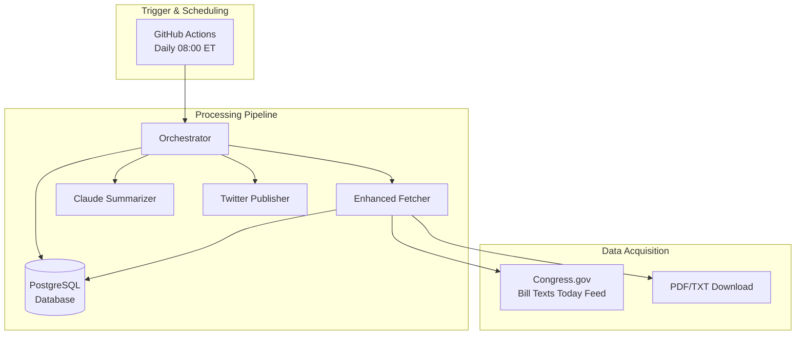

# TeenCivics New Workflow Design: Bill Texts Received Today Integration

## Overview

This document outlines the architectural design for transitioning TeenCivics from processing bills immediately upon introduction to using Congress.gov's "Bill Texts Received Today" feed as the daily trigger. This ensures bills are only processed when their authoritative full text is officially released.

## Current System Analysis

### Existing Components
- **Orchestrator**: [`src/orchestrator.py`](src/orchestrator.py:19-238) - Main workflow controller
- **Fetcher**: [`src/fetchers/congress_fetcher.py`](src/fetchers/congress_fetcher.py) - Currently uses Congress API
- **Database**: [`src/database/db.py`](src/database/db.py) - PostgreSQL with bills table
- **Scheduler**: [`.github/workflows/daily.yml`](.github/workflows/daily.yml) - GitHub Actions workflow

### Current Issues
- Bills processed before full text is available
- Incomplete/inaccurate summaries due to missing text
- Potential duplicate processing attempts

## New Architecture Design

### High-Level System Architecture



## Detailed Component Design

### 1. Enhanced Feed Parser ([`src/fetchers/congress_fetcher.py`](src/fetchers/congress_fetcher.py))

#### New Functions
```python
def fetch_bill_texts_today_feed(limit: int = 50) -> List[Dict[str, Any]]:
    """
    Fetches and parses the official "Bill Texts Received Today" HTML feed
    Returns bills with guaranteed full text availability
    """
    # Implementation details...
```

#### Feed Parsing Strategy
- Parse HTML table from https://www.congress.gov/bill-texts-received-today
- Extract bill metadata: ID, title, date, text URLs
- Download and process PDF/TXT content
- Validate text completeness before processing

#### Error Handling
- HTTP timeout and retry logic
- Malformed HTML fallback parsing
- PDF extraction failure handling
- Duplicate detection

### 2. Database Schema Enhancements

#### New Fields to Add
```sql
ALTER TABLE bills ADD COLUMN IF NOT EXISTS text_source TEXT DEFAULT 'feed';
ALTER TABLE bills ADD COLUMN IF NOT EXISTS text_received_date TIMESTAMP WITH TIME ZONE;
ALTER TABLE bills ADD COLUMN IF NOT EXISTS text_version INTEGER DEFAULT 1;
ALTER TABLE bills ADD COLUMN IF NOT EXISTS processing_attempts INTEGER DEFAULT 0;
ALTER TABLE bills ADD COLUMN IF NOT EXISTS last_processing_attempt TIMESTAMP WITH TIME ZONE;
```

#### Index Additions
```sql
CREATE INDEX IF NOT EXISTS idx_bills_text_received ON bills (text_received_date);
CREATE INDEX IF NOT EXISTS idx_bills_processing_attempts ON bills (processing_attempts);
CREATE UNIQUE INDEX IF NOT EXISTS idx_bills_id_version ON bills (bill_id, text_version);
```

### 3. Orchestrator Modifications ([`src/orchestrator.py`](src/orchestrator.py:19-238))

#### New Workflow Logic
1. **Feed Fetching**: Use only the "Bill Texts Received Today" feed
2. **Duplicate Prevention**: Check `text_received_date` and `text_version`
3. **Text Validation**: Ensure full text is available before summarization
4. **Version Tracking**: Handle amended/updated bill texts

#### Key Changes
- Replace `get_recent_bills()` with `fetch_bill_texts_today_feed()`
- Add text availability validation before summarization
- Implement version-aware processing
- Enhanced logging and metrics collection

### 4. Error Handling Strategy

#### Logging Levels
- **INFO**: Job timing, bill counts, successful processing
- **WARNING**: Empty feed, malformed data, skipped bills
- **ERROR**: Network failures, download errors, DB issues
- **CRITICAL**: Complete feed outages, repeated failures

#### Alerting Strategy
- Daily summary emails/Slack messages
- Immediate alerts for critical failures
- Metric tracking for trend analysis

#### Monitoring Metrics
- Bills found vs processed per run
- Average processing duration
- Error rates and types
- Consecutive empty runs detection

## Integration Points

### With Summarizer ([`src/processors/summarizer.py`](src/processors/summarizer.py))
- No changes required to summarizer interface
- Guaranteed full text input improves summary quality

### With Twitter Publisher ([`src/publishers/twitter_publisher.py`](src/publishers/twitter_publisher.py))
- No changes to publishing logic
- Better content quality from complete bill texts

### Database Integration
- Backward compatible schema changes
- Migration strategy for existing bills
- Data consistency checks

## Workflow Sequence

1. **08:00 ET Daily Trigger**: GitHub Actions workflow starts
2. **Feed Fetching**: Parse "Bill Texts Received Today" HTML
3. **Bill Processing**:
   - For each bill in feed:
     - Check if already processed (bill_id + text_version)
     - Download full text (PDF/TXT)
     - Validate text completeness
     - Generate summaries if new/updated
     - Store in database
     - Post to Twitter
4. **Completion**: Log metrics and send daily summary

## Testing Strategy

### Unit Tests
- Feed parsing accuracy
- PDF/TXT extraction reliability
- Duplicate detection logic
- Error handling scenarios

### Integration Tests
- End-to-end workflow testing
- Database schema migration testing
- Twitter posting simulation
- Error recovery testing

### Production Testing
- Dry-run mode validation
- Canary deployment with limited bills
- Monitoring and alert verification

## Migration Plan

### Phase 1: Preparation
1. Implement new fetcher with fallback to old API
2. Add database schema changes
3. Update orchestrator with conditional logic

### Phase 2: Testing
1. Run parallel processing for validation
2. Compare results between old and new methods
3. Fix discrepancies and edge cases

### Phase 3: Cutover
1. Switch exclusively to new feed processing
2. Monitor for 1-2 weeks
3. Remove old API code after validation

### Phase 4: Optimization
1. Fine-tune scheduling based on feed patterns
2. Optimize error handling and retry logic
3. Enhance monitoring and alerting

## Risk Mitigation

### Technical Risks
- **Feed Availability**: Implement retry logic and fallback monitoring
- **PDF Parsing**: Robust error handling and alternative text sources
- **Database Migration**: Schema changes with backward compatibility

### Operational Risks
- **Timing Issues**: Buffer time for feed updates and processing
- **Quality Assurance**: Validation checks for summary accuracy
- **Monitoring Gaps**: Comprehensive logging and alert coverage

## Performance Considerations

- Batch processing of multiple bills per run
- Parallel text download and processing
- Database query optimization
- Memory management for large text files

## Future Enhancements

- Real-time feed monitoring instead of daily batches
- Multiple text format support (XML, HTML)
- Advanced version tracking for amendments
- Machine learning for text quality assessment

## Implementation Timeline

1. **Week 1**: Enhanced fetcher implementation and testing
2. **Week 2**: Database schema changes and migration
3. **Week 3**: Orchestrator modifications and integration testing
4. **Week 4**: Production deployment and monitoring setup
5. **Week 5**: Optimization and fine-tuning

This design provides a robust, maintainable solution that addresses the core issue of processing bills only when complete text is available, ensuring higher quality summaries and preventing duplicate processing.