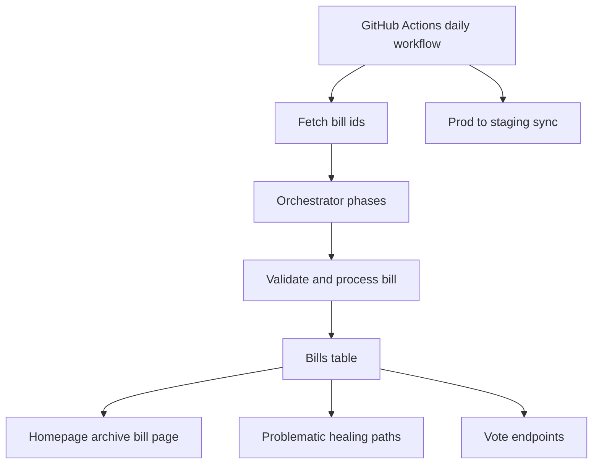

# TeenCivics Production and Staging Debug and Remediation Plan

Date: 2026-03-07

## Scope and confidence

This report is based on repository investigation only. I did not run live database queries against staging or production, so anything about current row state for the target bill slugs is an evidence-based hypothesis until verified with the existing diagnostic scripts and read-only SQL.

Primary code paths investigated:
- [src.orchestrator.main()](src/orchestrator.py:263)
- [src.orchestrator._recheck_problematic_bill()](src/orchestrator.py:163)
- [src.utils.validation.validate_bill_data()](src/utils/validation.py:17)
- [src.utils.validation.is_bill_ready_for_posting()](src/utils/validation.py:66)
- [src.database.db.select_and_lock_unposted_bill()](src/database/db.py:1237)
- [src.database.db.get_post_ready_count()](src/database/db.py:1308)
- [src.database.db.mark_bill_as_problematic()](src/database/db.py:1417)
- [src.database.db.unmark_bill_as_problematic()](src/database/db.py:1522)
- [src.fetchers.feed_parser.fetch_bill_ids_from_texts_received_today()](src/fetchers/feed_parser.py:237)
- [src.fetchers.feed_parser.fetch_bill_ids_from_api()](src/fetchers/feed_parser.py:196)
- [app.index()](app.py:413)
- [app.bill_detail()](app.py:616)
- [app.record_vote()](app.py:1325)
- [app.get_poll_results()](app.py:1381)
- [scripts/sync_prod_to_staging.py](scripts/sync_prod_to_staging.py)
- [scripts/backfill_problematic_bills.py](scripts/backfill_problematic_bills.py)

## Architecture snapshot

## Executive summary

1. The strongest repository-level explanation for unknown-status bills appearing on the public site is not the public posting path itself, but the recovery and visibility path: [src.orchestrator._recheck_problematic_bill()](src/orchestrator.py:163) now tries to persist derived status before unmarking, but if that persistence fails it still calls [src.database.db.unmark_bill_as_problematic()](src/database/db.py:1522). Because public queries only exclude hidden and problematic rows via [src.database.db.PUBLIC_FILTER](src/database/db.py:64), a recovered row can become public even with stale or missing `normalized_status`.
2. The strongest workflow-level explanation for unexpected production activity is that [`.github/workflows/daily.yml`](.github/workflows/daily.yml) runs on scheduled events, manual dispatch, and every push to `main` and `staging` at [`.github/workflows/daily.yml`](.github/workflows/daily.yml:11). That makes the daily pipeline broader than a true daily schedule.
3. The staging sync implementation is clearly one-way, but it is a destructive mirror for `bills` and `rep_contact_forms`, not an overlay sync. [scripts/sync_prod_to_staging.py](scripts/sync_prod_to_staging.py:109) deletes staging rows before insert, so staging-only rows in those tables do not survive.
4. Link preview metadata is partially implemented in templates and cache headers already, so the remaining likely root cause for the `Just a moment...` preview is Cloudflare challenge behavior rather than missing OG tags.
5. Live vote refresh has already been partially implemented, but in the wrong asset. The loaded template points to [static/script-2026-02-21-v3.js](static/script-2026-02-21-v3.js), while the live polling code exists in the unused [static/script.js](static/script.js:649).
6. The safest existing healing tool for the target bill slugs is [scripts/backfill_problematic_bills.py](scripts/backfill_problematic_bills.py:480), because it supports targeted `--bill-ids` and its local [scripts.backfill_problematic_bills.unmark_problematic()](scripts/backfill_problematic_bills.py:447) explicitly keeps `hidden = TRUE`. The generic periodic recheck writer is not the safest path for production healing.

---

## Issue 1: Why problematic and unknown-status bills are being pushed to the production site

### Current code path

Visibility path:
- [app.index()](app.py:413) uses [src.database.db.get_latest_tweeted_bill()](src/database/db.py:420) and falls back to [src.database.db.get_latest_bill()](src/database/db.py:398)
- [app.bill_detail()](app.py:616) uses [src.database.db.get_bill_by_slug()](src/database/db.py:442)
- Archive queries use [src.database.db.search_and_count_bills()](src/database/db.py:1019)
- All public queries rely on [src.database.db.PUBLIC_FILTER](src/database/db.py:64)

Ingestion and healing path:
- New and backlog processing flow through [src.orchestrator.main()](src/orchestrator.py:263)
- Final gating happens in [src.orchestrator.process_single_bill()](src/orchestrator.py:663) via [src.utils.validation.is_bill_ready_for_posting()](src/utils/validation.py:66)
- Problematic bill recovery flows through [src.orchestrator._recheck_problematic_bill()](src/orchestrator.py:163)

### Evidence

1. [src.database.db.PUBLIC_FILTER](src/database/db.py:62) is only `not hidden and not problematic`. The comment says it also ensures valid `normalized_status`, but the SQL does not.
2. [src.utils.validation.is_bill_ready_for_posting()](src/utils/validation.py:92) explicitly rejects missing `normalized_status`, but that gate only protects processing and posting. It does not protect already-stored public reads.
3. [src.orchestrator._recheck_problematic_bill()](src/orchestrator.py:215) attempts to persist derived status before unmarking, but the persistence block is wrapped in `try/except`, and [src.database.db.unmark_bill_as_problematic()](src/database/db.py:1522) is still called afterward even if persistence fails.
4. [src.database.db.unmark_bill_as_problematic()](src/database/db.py:1537) clears `problematic` but does not preserve or enforce `hidden`.
5. The safer targeted backfill script has its own [scripts.backfill_problematic_bills.unmark_problematic()](scripts/backfill_problematic_bills.py:447) which clears `problematic` while intentionally keeping `hidden = TRUE`.

### Likely root causes

1. **Public filter gap**: rows can be public while still having empty or stale `normalized_status`, which is enough for the site to render `Unknown`.
2. **Recovery ordering bug**: recovery can unmark a row even if the status persistence step failed.
3. **Hidden-state inconsistency**: the automatic unmark helper is not aligned with the safer healing script behavior.
4. **Potential candidate contamination**: if the feed scrape fails, the fallback in [src.fetchers.feed_parser.fetch_bill_ids_from_api()](src/fetchers/feed_parser.py:196) selects recently updated bills, not necessarily bills from `Texts Received Today`, which increases the chance that unstable or unusual bills enter the pipeline.

### Risks

- Bad rows can become visible without becoming truly post-ready.
- Future healing attempts may appear successful operationally while still leaving broken public state.
- Manual review can be bypassed if recovery clears `problematic` without forcing `hidden`.

### Safest recommended remediation

1. Treat public visibility and publish-readiness as separate controls.
2. Tighten public-read SQL so rows with empty `normalized_status` cannot render publicly.
3. Make recovery transactional: do not clear `problematic` unless status persistence succeeded and the bill still passes the full gate.
4. Align automatic recovery behavior with [scripts.backfill_problematic_bills.unmark_problematic()](scripts/backfill_problematic_bills.py:447), meaning recovered bills stay hidden until manual review.
5. For the target slugs, quarantine first, heal second, review third, unhide last.

---

## Issue 2: Debug the daily bill workflow

### Current code path

- Scheduler and environment wiring: [`.github/workflows/daily.yml`](.github/workflows/daily.yml)
- Feed selection: [src.fetchers.feed_parser.fetch_bill_ids_from_texts_received_today()](src/fetchers/feed_parser.py:237)
- Fallback candidate source: [src.fetchers.feed_parser.fetch_bill_ids_from_api()](src/fetchers/feed_parser.py:196)
- Reservoir and healing orchestration: [src.orchestrator.main()](src/orchestrator.py:263)
- Backlog selection: [src.database.db.select_and_lock_unposted_bill()](src/database/db.py:1237)
- Reservoir metrics: [src.database.db.get_unposted_count()](src/database/db.py:1292) and [src.database.db.get_post_ready_count()](src/database/db.py:1308)

### Evidence

1. [`.github/workflows/daily.yml`](.github/workflows/daily.yml:11) triggers on `workflow_dispatch` and every push to `main` and `staging`, not only on schedule.
2. [src.orchestrator.main()](src/orchestrator.py:318) only blocks duplicate posting for evening scans, not for all manual or push-driven runs.
3. [src.fetchers.feed_parser.fetch_bill_ids_from_texts_received_today()](src/fetchers/feed_parser.py:381) falls back to [src.fetchers.feed_parser.fetch_bill_ids_from_api()](src/fetchers/feed_parser.py:196), which queries `sort=updateDate desc`, a broader and noisier candidate set than `Texts Received Today`.
4. [src.database.db.get_post_ready_count()](src/database/db.py:1308) is strict, but [src.database.db.get_unposted_count()](src/database/db.py:1292) is broad. This mismatch is partly why [scripts/cleanup_limbo_bills.py](scripts/cleanup_limbo_bills.py) exists.
5. [`.github/workflows/daily.yml`](.github/workflows/daily.yml:191) runs staging sync even when the upstream `post-bill` job fails because of `if: always()`.

### Likely root causes

1. **Workflow over-triggering**: pushes can run the daily production logic outside expected windows.
2. **MANUAL scan behavior**: push or manual runs become `MANUAL`, bypassing the evening duplicate-prevention check.
3. **Fallback source drift**: when scrape paths fail, the workflow may consider bills that are not actually part of the intended daily text workflow.
4. **Operational ambiguity**: sync can run after partial or failed prod runs, making staging harder to reason about.

### Risks

- Unexpected production posts on merges or hotfixes.
- Inconsistent staging after failed production runs.
- Hard-to-reproduce behavior because scheduled and push paths share the same job.

### Safest recommended remediation

1. Split true scheduled posting from push-based CI.
2. Remove `push` from the production posting workflow or gate actual posting behind an explicit env flag that is false on push runs.
3. Log and persist the candidate source for every processed bill: `texts page`, `api fallback`, `db backlog`, `problematic recovery`.
4. Add a repository-level runbook for daily incident triage using dry-run orchestration plus row snapshots.
5. Verify whether staging should continue syncing on failed prod runs; if not, change the workflow condition.

---

## Issue 3: Verify whether staging sync worked as intended

### Current code path

- Workflow hook: [`.github/workflows/daily.yml`](.github/workflows/daily.yml:188)
- Sync implementation: [scripts/sync_prod_to_staging.py](scripts/sync_prod_to_staging.py)
- Existing lightweight verification: [scripts/verify_staging.py](scripts/verify_staging.py)

### Evidence

1. [scripts/sync_prod_to_staging.py](scripts/sync_prod_to_staging.py:7) states that `bills` and `rep_contact_forms` are synced while `votes` are isolated.
2. [scripts/sync_prod_to_staging.py](scripts/sync_prod_to_staging.py:109) deletes the staging table contents before insert.
3. [scripts/sync_prod_to_staging.py](scripts/sync_prod_to_staging.py:141) uses prod and staging URLs in a one-way direction only.
4. [scripts/verify_staging.py](scripts/verify_staging.py:15) only checks broad counts and argument prefixes, not prod-vs-staging equivalence, not target slugs, and not reverse-flow invariants.

### Likely root causes or intent mismatches

1. **If intent is full mirror**: the sync mostly matches that intent for `bills` and `rep_contact_forms`, and definitely prevents staging-to-prod flow.
2. **If intent is overlay**: the sync does not match. It destroys staging-only rows in `bills` and `rep_contact_forms`.
3. **Verification gap**: the repo lacks a strong comparison script for exact row parity on production rows and target slugs.

### Risks

- Staging-only bill fixtures disappear after sync.
- Teams may assume staging is an additive superset when it is actually a destructive mirror for synced tables.
- No proof that the eight target slugs are equivalent across prod and staging.

### Safest recommended remediation

1. First decide the intended semantic model:
   - **Mirror model**: staging should exactly match prod for synced tables
   - **Overlay model**: staging should contain prod plus staging-only rows
2. If mirror model is intended, keep the current algorithm but improve verification and documentation.
3. If overlay model is intended, replace delete-and-reinsert with key-based upsert from prod and mark row provenance.
4. Add read-only verification for:
   - total row counts
   - per-slug equality for the eight target slugs
   - absence of any prod write path from staging jobs
   - expected isolation of the `votes` table

---

## Issue 4: Link preview metadata so `teencivics.org` does not show `Just a moment...`

### Current code path

- Shared metadata: [templates/base.html](templates/base.html)
- Homepage overrides: [templates/index.html](templates/index.html)
- Bill page overrides: [templates/bill.html](templates/bill.html)
- Response caching and headers: [app.add_security_headers()](app.py:147)

### Evidence

1. OG and Twitter tags already exist in [templates/base.html](templates/base.html:11).
2. Page-specific overrides already exist in [templates/index.html](templates/index.html:7) and [templates/bill.html](templates/bill.html:8).
3. [app.add_security_headers()](app.py:169) explicitly sets short public cache headers for public HTML pages to help crawlers cache real content.
4. Repository comments and docs repeatedly associate preview problems with Cloudflare behavior rather than missing tags.

### Likely root causes

1. **Most likely**: Cloudflare challenge or bot-protection page is being served to preview crawlers.
2. **Secondary possibility**: preview bots receive cached challenge pages or stale edge responses.
3. **Less likely**: metadata gaps in origin HTML. The template layer already appears to cover the basics.

### Risks

- Fixing templates alone may not resolve previews.
- Social networks can cache bad previews for long periods after a transient challenge response.

### Safest recommended remediation

1. Verify real origin HTML for root and bill pages locally and on staging.
2. Verify Cloudflare responses for known preview user agents in production.
3. Add or adjust Cloudflare bypass rules so preview crawlers receive origin HTML without interstitial challenge.
4. Add the Facebook app identifier meta tag in [`templates/base.html`](templates/base.html:11): `fb:app_id = 1495910562545241`.
5. Re-test preview unfurlers after cache purge or after enough cache expiry.
6. Keep the existing OG meta structure and cache headers unless tests show a concrete metadata defect.

---

## Issue 5: Live vote updates for bill polls without manual refresh

### Current code path

Backend:
- [app.record_vote()](app.py:1325)
- [src.database.db.record_vote_and_update_poll()](src/database/db.py:1832)
- [app.get_poll_results()](app.py:1381)

Frontend:
- Loaded asset: [templates/base.html](templates/base.html:193)
- Loaded file: [static/script-2026-02-21-v3.js](static/script-2026-02-21-v3.js)
- Unused file containing live refresh logic: [static/script.js](static/script.js:649)

### Evidence

1. The backend already supports polling-style refresh via [app.get_poll_results()](app.py:1381).
2. The backend vote write path is already consolidated in [src.database.db.record_vote_and_update_poll()](src/database/db.py:1832).
3. Live polling logic exists in [static/script.js](static/script.js:649), including `LIVE_POLL_INTERVAL_MS`, `startLivePollRefresh`, and `restartLivePollRefresh`.
4. The production template loads [static/script-2026-02-21-v3.js](static/script-2026-02-21-v3.js:1), and that file does not include the live polling block.
5. [scripts/_test_changes.py](scripts/_test_changes.py:77) validates the wrong asset, so a repository smoke check can pass while production remains unchanged.
6. [tests/test_app_routes.py](tests/test_app_routes.py:206) still patches `update_poll_results` and `record_individual_vote`, but [app.record_vote()](app.py:1348) now uses [src.database.db.record_vote_and_update_poll()](src/database/db.py:1832). Test coverage is stale.

### Likely root causes

1. **Asset mismatch**: the live-update implementation exists but is not served.
2. **Test drift**: verification scripts and route tests still target older behavior.
3. **Product ambiguity**: `unsure` is accepted by [app.record_vote()](app.py:1345) but poll aggregates only expose yes and no.

### Risks

- Shipping another change into the unused file will not affect production.
- False confidence from tests.
- `unsure` may cause analytics or UI expectations to drift if not explicitly handled.

### Safest recommended remediation

1. Establish one canonical public JS asset.
2. Move or port the live refresh implementation into the file actually loaded by [templates/base.html](templates/base.html:193).
3. Update route and asset tests to match the current write path and actual shipped asset.
4. Decide whether `unsure` is a hidden personal vote only or a first-class aggregate option.
5. Start with polling, not websocket infrastructure, because the backend already supports it and the concurrency requirement is modest.

---

## Issue 6: Analyze the partially attempted backfill and healing effort for problematic and unknown-status bills in production

### Existing partial implementations in the repo

#### Most complete targeted repair path
- [scripts/backfill_problematic_bills.py](scripts/backfill_problematic_bills.py)
  - supports staging and prod targets at [scripts/backfill_problematic_bills.py](scripts/backfill_problematic_bills.py:483)
  - supports exact targeted bill IDs at [scripts/backfill_problematic_bills.py](scripts/backfill_problematic_bills.py:486)
  - locally unmarks while keeping hidden true at [scripts.backfill_problematic_bills.unmark_problematic()](scripts/backfill_problematic_bills.py:447)

#### Partial or narrower repair paths
- [scripts/backfill_bill_status.py](scripts/backfill_bill_status.py) for missing status only, staging-guarded against prod at [scripts/backfill_bill_status.py](scripts/backfill_bill_status.py:65)
- [scripts/problematic_recheck_audit.py](scripts/problematic_recheck_audit.py) for staging-only read-only audit
- [scripts/problematic_recheck_periodic.py](scripts/problematic_recheck_periodic.py) for staging-only scheduled recheck, dry-run by workflow
- [scripts/cleanup_limbo_bills.py](scripts/cleanup_limbo_bills.py) for converting incomplete non-problematic unpublished rows into problematic rows
- [scripts/_diag_bills.py](scripts/_diag_bills.py) for targeted row inspection, but it only includes five of the requested slugs at [scripts/_diag_bills.py](scripts/_diag_bills.py:18)

### Important inconsistencies and risks

1. [scripts/backfill_problematic_bills.py](scripts/backfill_problematic_bills.py:18) still says the hidden flag is cleared when bills pass validation, but the actual unmark helper no longer does that. The code is safer than the docstring.
2. [src.orchestrator._recheck_problematic_bill()](src/orchestrator.py:176) marks `recheck_attempted` before trying enrichment. This intentionally prevents infinite retries, but it also permanently locks a bill after a transient failure.
3. [scripts.problematic_recheck_periodic.apply_recovery_update()](scripts/problematic_recheck_periodic.py:181) clears `problematic` but does not preserve `hidden` and does not repair `status` or `normalized_status`. That makes it a weaker healing writer for this incident.
4. [src.database.db.unmark_bill_as_problematic()](src/database/db.py:1522) is less conservative than [scripts.backfill_problematic_bills.unmark_problematic()](scripts/backfill_problematic_bills.py:447).

### Likely root cause of the partial-healing gap

The repo contains at least three different healing concepts:
- orchestrator automatic delayed recheck
- staging-only periodic recheck script
- targeted comprehensive backfill script

They are not fully aligned on:
- whether hidden must stay true
- whether status fields are persisted before unmark
- whether prod is allowed
- whether a recovered bill should immediately become publicly visible

### Safest recommended remediation

Use the targeted comprehensive backfill script as the primary healing path for this incident, not the generic periodic write path and not automatic orchestrator healing for the target slugs.

---

## Target slugs: repository findings and safest strategy

Target set:
- `sres554-119`
- `sres571-119`
- `sres573-119`
- `s3578-119`
- `sres493-119`
- `s3172-119`
- `s3162-119`
- `sres497-119`

### What already exists for these slugs

- No slug-specific remediation logic was found in the application code.
- [scripts/_diag_bills.py](scripts/_diag_bills.py:18) covers only:
  - `s3578-119`
  - `sres493-119`
  - `s3172-119`
  - `s3162-119`
  - `sres497-119`
- The remaining three target slugs do not appear in any repository diagnostic script.
- [scripts/backfill_problematic_bills.py](scripts/backfill_problematic_bills.py:486) supports exact targeted processing for all eight via `--bill-ids`.

### Safest backfill and healing strategy for the target slugs

1. **Freeze automatic risk before touching data**
   - Temporarily freeze the daily production workflow using the existing `DAILY_BILLS_FROZEN` check in [src.orchestrator.main()](src/orchestrator.py:279) or otherwise prevent automated healing and posting during the incident window.

2. **Take a before snapshot for all eight slugs in production**
   - Capture at minimum:
     - `bill_id`
     - `status`
     - `normalized_status`
     - `problematic`
     - `problem_reason`
     - `hidden`
     - `published`
     - `sponsor_name`
     - `full_text` length
     - summary field lengths
     - `teen_impact_score`
     - `recheck_attempted`
     - `problematic_marked_at`
   - Use read-only SQL or expand the logic of [scripts/_diag_bills.py](scripts/_diag_bills.py:18) operationally.

3. **Quarantine visibility first**
   - If any target slug is currently public and suspect, set `hidden = TRUE` before healing.
   - This is critical because the safest existing healing script preserves hidden state but does not proactively hide already-public rows.

4. **Run targeted dry-run metadata-only repair first**
   - Use [scripts/backfill_problematic_bills.py](scripts/backfill_problematic_bills.py:480) with the exact eight bill IDs and `--skip-summaries` in dry-run mode.
   - Goal: confirm which rows can recover cleanly at the metadata layer without invoking AI regeneration.

5. **Run targeted full dry-run second**
   - Same exact bill ID list, full dry-run without `--apply`.
   - Goal: determine which bills would become fully post-ready after summaries and arguments are regenerated.

6. **Review dry-run output row by row**
   - Separate bills into:
     - recoverable now
     - metadata repaired but still not post-ready
     - still problematic
     - missing from DB and needing special handling

7. **Apply only to the exact approved slugs**
   - Use [scripts/backfill_problematic_bills.py](scripts/backfill_problematic_bills.py:486) in targeted apply mode.
   - Do not use broad production-wide healing first.

8. **Keep recovered bills hidden after apply**
   - Rely on [scripts.backfill_problematic_bills.unmark_problematic()](scripts/backfill_problematic_bills.py:447), which preserves `hidden = TRUE`.
   - Manual review is required before any unhide action.

9. **Never use automatic unhide as part of healing**
   - A bill can move from `problematic = TRUE` to `problematic = FALSE` while still remaining hidden.
   - Unhide must be a separate, manual approval step after row review.

10. **If a bill fails healing, do not unhide and do not downgrade safeguards**
    - Leave `hidden = TRUE`
    - Leave `problematic = TRUE`
    - Preserve `problem_reason`
    - Do not switch to the periodic write path as a fallback for production

### Why this is the safest strategy

- It is targeted, reversible, and auditable.
- It uses the one repo path that already supports exact bill IDs and conservative hidden handling.
- It avoids the weaker write semantics in [scripts/problematic_recheck_periodic.py](scripts/problematic_recheck_periodic.py:181).
- It avoids depending on automatic orchestrator recovery during an incident.

---

## Local validation vs staging and production validation

### Can be validated locally

1. Template metadata presence and structure in [templates/base.html](templates/base.html), [templates/index.html](templates/index.html), and [templates/bill.html](templates/bill.html)
2. Workflow trigger definitions in [`.github/workflows/daily.yml`](.github/workflows/daily.yml)
3. Recovery and visibility logic in [src/orchestrator.py](src/orchestrator.py) and [src/database/db.py](src/database/db.py)
4. Asset mismatch between [templates/base.html](templates/base.html:193), [static/script-2026-02-21-v3.js](static/script-2026-02-21-v3.js), and [static/script.js](static/script.js:649)
5. Test drift in [tests/test_app_routes.py](tests/test_app_routes.py:199) and [scripts/_test_changes.py](scripts/_test_changes.py:77)

### Requires staging verification

1. Dry-run repair outputs against staging data using [scripts/backfill_problematic_bills.py](scripts/backfill_problematic_bills.py)
2. Prod-to-staging parity for the eight target slugs after sync
3. Staging preview behavior behind the `/beta` deployment path and middleware in [app.py](app.py:64)
4. Live vote polling behavior in the deployed staging asset bundle

### Requires production verification

1. Actual current row state for the eight target slugs
2. Whether any suspect bill is currently visible on the public site
3. Real preview bot behavior through Cloudflare for root and bill pages
4. One-way sync correctness using prod and staging read-only diff queries
5. Post-healing verification that recovered target slugs remain hidden until manual review

---

## Proposed execution sequence by phase

### Phase 0: Safety and evidence capture

1. Freeze or gate automated prod activity.
2. Snapshot the eight target slugs from prod and staging.
3. Record whether each slug is currently public, hidden, problematic, or missing.
4. Decide whether staging is intended to be a mirror or an overlay.

### Phase 1: Immediate containment for public bad rows

1. Hide any currently public suspect target slug.
2. Confirm public query behavior for missing `normalized_status` rows.
3. Stop using automatic healing for the target slugs during the incident.

### Phase 2: Daily workflow root-cause validation

1. Review recent prod runs against trigger type: schedule, push, or manual.
2. Confirm whether scrape fallback was used and whether candidate source drift occurred.
3. Decide the future trigger model for prod posting.

### Phase 3: Staging sync verification

1. Run read-only prod-vs-staging comparisons for the target slugs.
2. Confirm whether staging-only rows in `bills` and `rep_contact_forms` are expected to survive.
3. Document sync semantics and fix verification coverage.

### Phase 4: Link preview remediation

1. Verify origin metadata locally and on staging.
2. Test production responses for preview crawler user agents.
3. Adjust Cloudflare behavior if challenge pages are being served.
4. Re-test unfurls after cache expiry or purge.

### Phase 5: Live vote update rollout plan

1. Confirm canonical shipped JS asset.
2. Move the existing live polling logic into the shipped asset.
3. Update route and frontend smoke tests to target the shipped asset and current DB write path.
4. Validate multi-client behavior on staging.

### Phase 6: Targeted backfill and healing for the eight slugs

1. Quarantine visibility first.
2. Run metadata-only dry-run.
3. Run full dry-run.
4. Review per-bill outcomes.
5. Apply to the exact approved IDs only.
6. Verify all recovered bills remain hidden.
7. Manually review before any unhide.

### Phase 7: Regression hardening

1. Align public-read filters with final-gate expectations.
2. Align all healing paths on hidden preservation and transactional unmark rules.
3. Remove or update stale tests and docs.
4. Add operational verification checklists.

---

## Partial implementation already present in the repo

### Already implemented and useful

- Conservative final gate: [src.utils.validation.is_bill_ready_for_posting()](src/utils/validation.py:66)
- Strict backlog selection: [src.database.db.select_and_lock_unposted_bill()](src/database/db.py:1237)
- Delayed problematic recovery path: [src.orchestrator._recheck_problematic_bill()](src/orchestrator.py:163)
- Targeted comprehensive backfill: [scripts/backfill_problematic_bills.py](scripts/backfill_problematic_bills.py)
- One-way prod-to-staging sync skeleton: [scripts/sync_prod_to_staging.py](scripts/sync_prod_to_staging.py)
- Poll live refresh logic, but in the wrong asset: [static/script.js](static/script.js:649)
- OG and Twitter metadata blocks: [templates/base.html](templates/base.html:11)
- Public cache headers meant to help crawlers: [app.add_security_headers()](app.py:169)

### Implemented but incomplete, inconsistent, or risky

- Public filter comment claims more than the SQL enforces: [src.database.db.PUBLIC_FILTER](src/database/db.py:64)
- Automatic recovery unmarks even if status persistence fails: [src.orchestrator._recheck_problematic_bill()](src/orchestrator.py:219)
- Generic unmark helper does not preserve hidden state: [src.database.db.unmark_bill_as_problematic()](src/database/db.py:1522)
- Periodic recheck writer is weaker than the comprehensive backfill tool: [scripts.problematic_recheck_periodic.apply_recovery_update()](scripts/problematic_recheck_periodic.py:181)
- Staging verification is too shallow: [scripts/verify_staging.py](scripts/verify_staging.py)
- Frontend tests target an unused asset: [scripts/_test_changes.py](scripts/_test_changes.py:77)
- Vote route tests patch an older DB API shape: [tests/test_app_routes.py](tests/test_app_routes.py:206)

---

## Rollout and verification checklists

### Checklist A: Prod visibility containment

- [ ] Confirm whether any of the eight target slugs are currently public
- [ ] Hide any suspect public target slug before healing
- [ ] Snapshot before-state for all eight target slugs
- [ ] Freeze automated prod healing or posting during repair window

### Checklist B: Targeted healing dry-run

- [ ] Run targeted metadata-only dry-run for all eight slugs
- [ ] Run targeted full dry-run for all eight slugs
- [ ] Review per-slug readiness outcome and missing reasons
- [ ] Approve exact apply list

### Checklist C: Post-apply verification

- [ ] Verify `problematic` cleared only for intended rows
- [ ] Verify `hidden = TRUE` remains true for recovered rows
- [ ] Verify `status` and `normalized_status` are populated
- [ ] Verify summary lengths and `teen_impact_score`
- [ ] Verify no failed row became more publicly visible than before

### Checklist D: Staging sync verification

- [ ] Compare bill counts between prod and staging
- [ ] Compare the eight target slugs field by field
- [ ] Confirm `votes` remain isolated
- [ ] Confirm no staging write path can target prod

### Checklist E: Link preview verification

- [ ] Validate OG tags in origin HTML for homepage and bill page
- [ ] Validate preview bot response through Cloudflare in prod
- [ ] Confirm the response is origin HTML, not a challenge page
- [ ] Re-check preview after cache reset window

### Checklist F: Live vote verification

- [ ] Confirm the deployed asset contains live polling code
- [ ] Verify two browser sessions see changes within the refresh interval
- [ ] Verify no duplicate fetch storms or console errors
- [ ] Verify poll counts stay consistent with DB aggregates

---

## Approval-ready implementation priorities

### Highest priority

1. Contain public visibility risk for the target slugs.
2. Verify and repair the eight target rows using targeted dry-run then targeted apply on staging first, then production only after staging review passes.
3. Fix the public filter and recovery ordering mismatch.
4. Treat the public filter change as the highest-risk code diff in the implementation set and require careful diff review before anything reaches `main`.
5. Narrow the daily workflow trigger model.

### Medium priority

1. Clarify and harden staging sync semantics.
2. Resolve Cloudflare preview behavior.
3. Ship live vote polling in the actual deployed asset.

### Lower priority but important cleanup

1. Remove stale tests and stale comments.
2. Consolidate healing paths so there is one authoritative production-safe repair flow.
3. Improve operational diagnostics for slug-level parity checks and incident reviews.

---

## Implementation guardrails

1. Treat the [`src.database.db.PUBLIC_FILTER`](src/database/db.py:64) change as the highest-stakes visibility change in the whole remediation set. Review that diff separately before merge to `main`.
2. Backfill the eight target slugs on staging first, verify their rendered pages and row state there, and only then run the equivalent targeted process against production.
3. Keep healing and unhiding as separate actions. A successful repair must not imply immediate public visibility.
4. Prefer the targeted [`scripts/backfill_problematic_bills.py`](scripts/backfill_problematic_bills.py) path over broad production-wide healing.

## Recommended next implementation mode

Once approved, this plan is ready for implementation in [💻 Code](../README.md) mode, with production-affecting work broken into separate, reviewable changesets:

1. Public filter and healing safety changes
2. Workflow trigger and sync verification changes
3. Live vote asset consolidation
4. Cloudflare-preview operational changes and validation docs
5. Targeted production healing runbook execution
