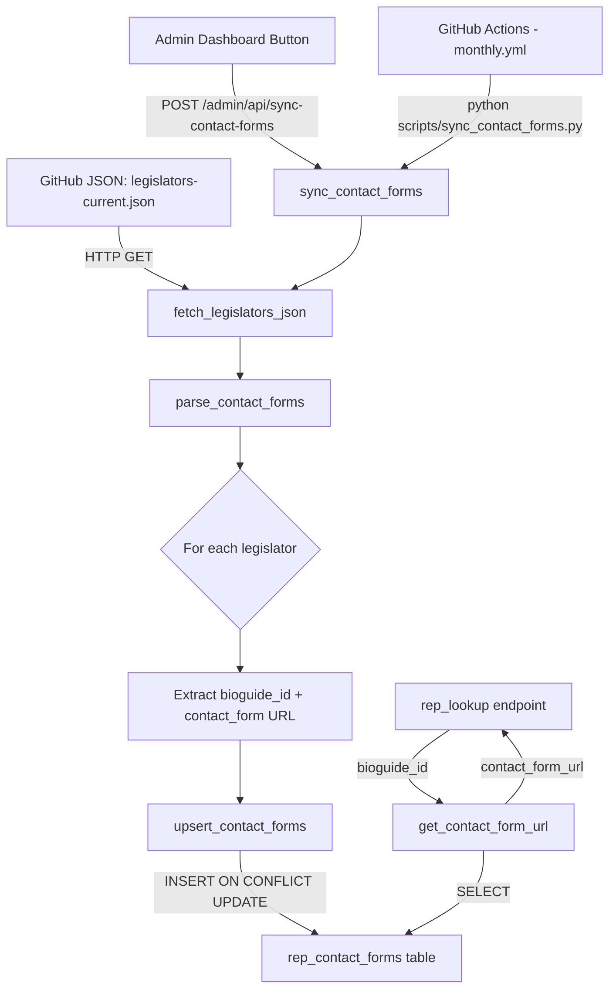

# Rep Contact Form URL Sync — Implementation Plan

## Overview

The Tell Your Rep feature currently appends `/contact` to a rep's homepage URL when no email is available ([`buildContactFallbackHtml()`](static/tell-rep.js:492)). This is unreliable because House member websites don't use standardized contact paths.

This plan adds a `rep_contact_forms` lookup table populated from the public `unitedstates/congress-legislators` dataset, which includes verified `contact_form` URLs for each legislator. The system syncs monthly via GitHub Actions and on-demand via an admin button.

---

## 1. Database Schema

### Table: `rep_contact_forms`

```sql
CREATE TABLE IF NOT EXISTS rep_contact_forms (
    id SERIAL PRIMARY KEY,
    bioguide_id VARCHAR(10) UNIQUE NOT NULL,
    name TEXT NOT NULL,
    state VARCHAR(2) NOT NULL,
    district INTEGER,              -- NULL for senators
    chamber VARCHAR(10) NOT NULL,  -- 'house' or 'senate'
    official_url TEXT,             -- official website URL
    contact_form_url TEXT,         -- verified contact form URL from dataset
    url_validated BOOLEAN DEFAULT FALSE,
    url_last_checked TIMESTAMP,
    created_at TIMESTAMP DEFAULT CURRENT_TIMESTAMP,
    updated_at TIMESTAMP DEFAULT CURRENT_TIMESTAMP
);
```

### Indexes

```sql
CREATE INDEX IF NOT EXISTS idx_rcf_bioguide_id ON rep_contact_forms(bioguide_id);
CREATE INDEX IF NOT EXISTS idx_rcf_state_district ON rep_contact_forms(state, district);
CREATE INDEX IF NOT EXISTS idx_rcf_chamber ON rep_contact_forms(chamber);
```

### Updated_at trigger

Reuse the existing [`update_updated_at_column()`](src/database/connection.py:241) trigger function — just attach a new trigger:

```sql
CREATE TRIGGER update_rcf_updated_at
    BEFORE UPDATE ON rep_contact_forms
    FOR EACH ROW
    EXECUTE FUNCTION update_updated_at_column();
```

---

## 2. Migration Script

**File:** `scripts/add_rep_contact_forms_table.py`

Follow the exact pattern from [`scripts/add_votes_table.py`](scripts/add_votes_table.py:1):

```
#!/usr/bin/env python3
"""
Database schema migration script to add the rep_contact_forms table.
Stores verified contact form URLs for congressional representatives.
"""
dotenv → load_dotenv()
sys.path.insert(0, ...)
from src.database.connection import postgres_connect

def add_rep_contact_forms_table():
    # Check if table exists via information_schema
    # CREATE TABLE IF NOT EXISTS ...
    # CREATE INDEX IF NOT EXISTS ...
    # Attach updated_at trigger
    # conn.commit()

def verify_table():
    # Query information_schema.columns for rep_contact_forms
    # Query pg_indexes for indexes
    
def main():
    # add_rep_contact_forms_table() → verify_table()
```

Also register the table in [`init_db_tables()`](src/database/connection.py:176) so new deployments auto-create it.

---

## 3. Sync Module

**File:** `src/fetchers/contact_form_sync.py`

### Data Source

```
https://theunitedstates.io/congress-legislators/legislators-current.json
```

Each legislator entry contains:
- `id.bioguide` — unique identifier matching Congress.gov API `bioguideId`
- `name.first`, `name.last` — full name
- `terms[-1].type` — `"rep"` or `"sen"` for current term
- `terms[-1].state` — two-letter state code
- `terms[-1].district` — integer district number for House members
- `terms[-1].url` — official website
- `terms[-1].contact_form` — **the contact form URL we need**

### Function Signatures

```python
"""
Sync representative contact form URLs from the unitedstates/congress-legislators dataset.
"""

import logging
import requests
from typing import Dict, List, Optional, Tuple
from src.database.connection import postgres_connect

logger = logging.getLogger(__name__)

LEGISLATORS_URL = "https://theunitedstates.io/congress-legislators/legislators-current.json"
SYNC_TIMEOUT = 30  # seconds


def fetch_legislators_json() -> List[Dict]:
    """
    Fetch the current legislators JSON from the unitedstates project.
    Returns list of legislator dicts or empty list on failure.
    """
    # requests.get(LEGISLATORS_URL, timeout=SYNC_TIMEOUT)
    # resp.raise_for_status()
    # return resp.json()
    ...


def parse_contact_forms(legislators: List[Dict]) -> List[Dict]:
    """
    Extract contact form data from raw legislators JSON.
    
    Returns list of dicts with keys:
      bioguide_id, name, state, district, chamber, official_url, contact_form_url
    """
    # For each legislator:
    #   last_term = legislator["terms"][-1]
    #   bioguide_id = legislator["id"]["bioguide"]
    #   name = f"{legislator['name']['first']} {legislator['name']['last']}"
    #   chamber = "house" if last_term["type"] == "rep" else "senate"
    #   state = last_term["state"]
    #   district = last_term.get("district")  # None for senators
    #   official_url = last_term.get("url")
    #   contact_form_url = last_term.get("contact_form")
    ...


def validate_url(url: str, timeout: int = 10) -> bool:
    """
    Validate a URL is reachable via HEAD request (fallback to GET).
    Returns True if response status < 400.
    """
    # HEAD request first (lightweight)
    #   If 405 Method Not Allowed, retry with GET
    # Catch requests.Timeout, requests.ConnectionError
    # Return False on failure
    ...


def upsert_contact_forms(records: List[Dict], validate: bool = False) -> Tuple[int, int, int]:
    """
    Upsert contact form records into the rep_contact_forms table.
    
    Args:
        records: Parsed legislator contact form data
        validate: If True, run HEAD requests to validate URLs (slow)
    
    Returns:
        (inserted, updated, skipped) counts
    """
    # with postgres_connect() as conn:
    #   with conn.cursor() as cursor:
    #     for record in records:
    #       INSERT ... ON CONFLICT (bioguide_id) DO UPDATE SET
    #         name, state, district, chamber, official_url, contact_form_url,
    #         url_validated (if validate=True), url_last_checked
    ...


def sync_contact_forms(validate: bool = False) -> Dict:
    """
    Full sync pipeline: Fetch → Parse → Upsert.
    
    Returns dict with sync stats:
      {success, total, inserted, updated, skipped, errors, timestamp}
    """
    # 1. fetch_legislators_json()
    # 2. parse_contact_forms(legislators)
    # 3. upsert_contact_forms(records, validate)
    # 4. Return summary dict
    ...


def get_contact_form_url(bioguide_id: str) -> Optional[str]:
    """
    Look up the contact form URL for a given bioguide ID.
    Returns the URL string or None if not found.
    """
    # SELECT contact_form_url FROM rep_contact_forms
    # WHERE bioguide_id = %s
    ...


def get_contact_form_by_state_district(state: str, district: int) -> Optional[Dict]:
    """
    Look up contact form data by state and district.
    Returns dict with contact_form_url, official_url, name or None.
    """
    # SELECT * FROM rep_contact_forms
    # WHERE state = %s AND district = %s AND chamber = 'house'
    ...
```

### Data Flow Diagram



---

## 4. Integration Points

### 4a. Backend: [`rep_lookup()`](app.py:1450) Endpoint Changes

After the existing member lookup builds the `result` dict (around line 1580), add a database lookup:

```python
# --- NEW: Cross-reference contact form URL ---
if bioguide_id:
    try:
        from src.fetchers.contact_form_sync import get_contact_form_url
        contact_form = get_contact_form_url(bioguide_id)
        if contact_form:
            result["contact_form_url"] = contact_form
    except Exception as e:
        logger.warning(f"Contact form lookup failed for {bioguide_id}: {e}")

# result dict already has: name, website, email, photo_url, bioguideId, state, district, found
# NEW field: contact_form_url (string or absent)
```

The `result` dict returned by [`rep_lookup()`](app.py:1450) gets a new optional field:
- `contact_form_url` — the verified contact form URL, or absent if not found

### 4b. Frontend: [`buildContactFallbackHtml()`](static/tell-rep.js:492) Changes

Currently this function appends `/contact` to the website URL:
```javascript
const contactUrl = rawWebsite === "#"
  ? "#"
  : rawWebsite.replace(/\/+$/, "") + "/contact";
```

Change to prefer `contact_form_url` from the API response:

```javascript
function buildContactFallbackHtml(emailData, primaryRep) {
    const name = _escHtml(primaryRep.name || "your representative");
    
    // Prefer verified contact_form_url, fall back to website + /contact
    let contactUrl;
    if (primaryRep.contact_form_url) {
        contactUrl = primaryRep.contact_form_url;
    } else {
        const rawWebsite = primaryRep.website || "#";
        contactUrl = rawWebsite === "#"
            ? "#"
            : rawWebsite.replace(/\/+$/, "") + "/contact";
    }
    const website = _escHtml(contactUrl);
    // ... rest unchanged
}
```

Also pass `contact_form_url` through from the rep data in [`showEmailEditor()`](static/tell-rep.js:442) — it already passes `primaryRep` which will include the new field from the API response.

### 4c. Cache Integration

The existing [`_rep_cache`](app.py:1276) in-memory cache already caches the full `result` dict. Since we're adding `contact_form_url` to that dict, it gets cached automatically. No changes needed.

---

## 5. Admin UI

### 5a. Dashboard Button

Add a "Sync Rep Contact Forms" card to [`templates/admin/dashboard.html`](templates/admin/dashboard.html:28) inside the existing `.admin-nav-cards` div:

```html
<div class="admin-nav-cards">
    <!-- existing cards... -->
    
    <div class="admin-nav-card" id="sync-contact-forms-card">
        <h3>📇 Rep Contact Forms</h3>
        <p>Sync contact form URLs from the legislators dataset.</p>
        <button class="btn btn-primary" id="btn-sync-contact-forms" type="button">
            🔄 Sync Now
        </button>
        <div id="sync-contact-forms-status" class="sync-status" style="display: none;"></div>
    </div>
</div>
```

### 5b. Admin API Route

**In [`app.py`](app.py:1):**

```python
@app.route("/admin/api/sync-contact-forms", methods=["POST"])
@admin_required
@csrf.exempt
def admin_sync_contact_forms():
    """Trigger manual sync of rep contact form URLs."""
    try:
        from src.fetchers.contact_form_sync import sync_contact_forms
        result = sync_contact_forms(validate=False)
        return jsonify(result)
    except Exception as e:
        logger.error(f"Contact form sync error: {e}", exc_info=True)
        return jsonify({"success": False, "error": str(e)}), 500
```

### 5c. Admin JS

Add to [`static/admin.js`](static/admin.js:1) — a click handler for the sync button:

```javascript
// --- Sync Contact Forms ---
function initSyncContactForms() {
    const btn = document.getElementById("btn-sync-contact-forms");
    if (!btn) return;
    
    btn.addEventListener("click", async () => {
        btn.disabled = true;
        btn.textContent = "Syncing…";
        const statusEl = document.getElementById("sync-contact-forms-status");
        
        try {
            const resp = await fetch("/admin/api/sync-contact-forms", {
                method: "POST",
                headers: { "X-Request-ID": crypto.randomUUID() },
            });
            const data = await resp.json();
            
            if (data.success) {
                statusEl.textContent = 
                    `✅ Synced ${data.total} reps (${data.inserted} new, ${data.updated} updated)`;
                statusEl.className = "sync-status sync-success";
            } else {
                statusEl.textContent = `❌ ${data.error || "Sync failed"}`;
                statusEl.className = "sync-status sync-error";
            }
            statusEl.style.display = "block";
        } catch (e) {
            statusEl.textContent = "❌ Network error";
            statusEl.className = "sync-status sync-error";
            statusEl.style.display = "block";
        } finally {
            btn.disabled = false;
            btn.textContent = "🔄 Sync Now";
        }
    });
}
```

Call `initSyncContactForms()` from the admin bootstrap.

---

## 6. Scheduling — GitHub Actions

**File:** `.github/workflows/monthly-contact-sync.yml`

Follow the pattern from [`.github/workflows/daily.yml`](.github/workflows/daily.yml:1):

```yaml
name: Monthly Rep Contact Form Sync

on:
  schedule:
    - cron: '0 6 1 * *'  # 1st of each month at 6:00 AM UTC
  workflow_dispatch:       # Allow manual triggering

jobs:
  sync-contact-forms:
    runs-on: ubuntu-latest
    timeout-minutes: 10

    steps:
    - name: Checkout code
      uses: actions/checkout@v4

    - name: Set up Python
      uses: actions/setup-python@v4
      with:
        python-version: '3.10'

    - name: Install dependencies
      run: |
        python -m pip install --upgrade pip
        pip install psycopg2-binary python-dotenv requests

    - name: Sync contact forms
      env:
        DATABASE_URL: ${{ secrets.DATABASE_URL }}
      run: |
        python scripts/sync_contact_forms.py
```

**File:** `scripts/sync_contact_forms.py`

CLI wrapper following the migration script pattern:

```python
#!/usr/bin/env python3
"""CLI script to sync rep contact form URLs."""
import os, sys, logging
from dotenv import load_dotenv
load_dotenv()
sys.path.insert(0, os.path.dirname(os.path.dirname(os.path.abspath(__file__))))

from src.fetchers.contact_form_sync import sync_contact_forms

logging.basicConfig(level=logging.INFO, format="%(asctime)s - %(levelname)s - %(message)s")
logger = logging.getLogger(__name__)

def main():
    logger.info("=" * 60)
    logger.info("Rep Contact Form Sync")
    logger.info("=" * 60)
    result = sync_contact_forms(validate=False)
    if result.get("success"):
        logger.info(f"✅ Synced {result['total']} reps "
                     f"({result['inserted']} new, {result['updated']} updated)")
        sys.exit(0)
    else:
        logger.error(f"❌ Sync failed: {result.get('error', 'Unknown')}")
        sys.exit(1)

if __name__ == "__main__":
    main()
```

---

## 7. Error Handling

| Scenario | Handling |
|---|---|
| GitHub JSON unreachable / timeout | `fetch_legislators_json()` returns `[]`, `sync_contact_forms()` returns `{success: False, error: "..."}`. Admin UI shows error. No DB changes. |
| Malformed JSON entry missing fields | `parse_contact_forms()` skips entries with no `bioguide` or no `terms`. Logs warning + increments `skipped` counter. |
| NULL `contact_form` in dataset | Record saved with `contact_form_url = NULL`. Frontend falls back to existing `website + /contact` logic. |
| HEAD/GET validation timeout | `validate_url()` returns `False`. Record saved with `url_validated = FALSE`. Does not block upsert. |
| Database connection failure during sync | Exception propagates up, caught by admin route or CLI. Returns `{success: False, error: "..."}`. |
| `get_contact_form_url()` fails at request time | `rep_lookup()` catches exception, logs warning, omits `contact_form_url` from response. Frontend falls back gracefully. |
| Stale data after rep changes mid-term | Monthly sync refreshes all records. Admin can trigger on-demand sync. `ON CONFLICT DO UPDATE` handles replacements. |

---

## 8. File List

### New Files

| File | Purpose |
|---|---|
| `src/fetchers/contact_form_sync.py` | Core sync module: fetch, parse, upsert, lookup |
| `scripts/add_rep_contact_forms_table.py` | Database migration script |
| `scripts/sync_contact_forms.py` | CLI wrapper for manual/CI sync |
| `.github/workflows/monthly-contact-sync.yml` | GitHub Actions monthly schedule |

### Modified Files

| File | Changes |
|---|---|
| [`src/database/connection.py`](src/database/connection.py:176) | Add `rep_contact_forms` table + indexes + trigger to `init_db_tables()` |
| [`app.py`](app.py:1450) | Add `contact_form_url` to `rep_lookup()` result; add `admin_sync_contact_forms` route |
| [`static/tell-rep.js`](static/tell-rep.js:492) | Update `buildContactFallbackHtml()` to prefer `contact_form_url` |
| [`static/admin.js`](static/admin.js:1) | Add `initSyncContactForms()` handler |
| [`static/admin.css`](static/admin.css) | Minor styles for sync status indicator |
| [`templates/admin/dashboard.html`](templates/admin/dashboard.html:28) | Add "Rep Contact Forms" admin card with sync button |

---

## 9. Implementation Order

1. **Migration script** — `scripts/add_rep_contact_forms_table.py`
2. **Schema bootstrap** — update `init_db_tables()` in `connection.py`
3. **Sync module** — `src/fetchers/contact_form_sync.py`
4. **CLI script** — `scripts/sync_contact_forms.py`
5. **Run initial sync** — populate the table
6. **Backend integration** — modify `rep_lookup()` in `app.py`
7. **Frontend integration** — modify `buildContactFallbackHtml()` in `tell-rep.js`
8. **Admin UI** — dashboard button + route + JS handler
9. **GitHub Action** — `monthly-contact-sync.yml`
10. **Testing** — verify end-to-end flow with real ZIP codes
