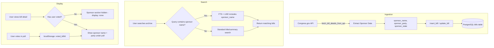

# Sponsor Search & Reveal-After-Vote Feature

## Overview

Allow users to search for bills by sponsor, while the sponsor info remains completely hidden on the UI until the user has voted. The sponsor data is stored in the database (enabling search) but only revealed on the bill detail page **after voting**, placed under the poll results section.

**Key Design Decisions:**
- Sponsor data is searchable but invisible in search results
- No sponsor shown on archive cards (before OR after voting)
- Sponsor only appears on bill detail page, under poll results, after user votes
- Simple instant reveal - no animations or blurred placeholders

## Current State Analysis

### What Exists
- **Database**: Bills table with title, summary, status, poll results, etc. - **NO sponsor columns**
- **Congress Fetcher**: Fetches bill details from API but does **NOT** extract sponsor info
- **Summarizer**: References `bill.get("sponsor")` but sponsor is never populated
- **Search**: FTS on `title` and `summary_long` only
- **Poll System**: Uses localStorage (`voted_{billId}`) to track votes

### What's Missing
- Database columns for sponsor info
- API extraction of sponsor data
- Sponsor data for existing bills
- Search indexing of sponsor fields
- UI components for sponsor display with reveal logic

---

## Implementation Plan

### Phase 1: Database Schema Updates

#### 1.1 Create Migration Script
**File**: `scripts/add_sponsor_columns.py`

Add three new columns to the `bills` table:
```sql
ALTER TABLE bills
ADD COLUMN IF NOT EXISTS sponsor_name TEXT,
ADD COLUMN IF NOT EXISTS sponsor_party TEXT,
ADD COLUMN IF NOT EXISTS sponsor_state TEXT;
```

Also create an index for search performance:
```sql
CREATE INDEX IF NOT EXISTS idx_bills_sponsor_name ON bills (sponsor_name);
```

#### 1.2 Update `init_db_tables()` 
**File**: `src/database/connection.py`

Add sponsor columns to the CREATE TABLE statement for new deployments.

---

### Phase 2: Congress.gov API Integration

#### 2.1 Update `fetch_bill_details_from_api()`
**File**: `src/fetchers/congress_fetcher.py`

The Congress.gov API returns sponsor data in the bill response. Extract:
- `sponsors[0].fullName` → `sponsor_name`
- `sponsors[0].party` → `sponsor_party`  
- `sponsors[0].state` → `sponsor_state`

Example API response structure:
```json
{
  "bill": {
    "sponsors": [{
      "bioguideId": "S001145",
      "fullName": "Rep. Schakowsky, Janice D. [D-IL-9]",
      "firstName": "JANICE",
      "lastName": "SCHAKOWSKY",
      "party": "D",
      "state": "IL",
      "district": 9
    }]
  }
}
```

#### 2.2 Update `fetch_bills_from_feed()`
**File**: `src/fetchers/congress_fetcher.py`

After fetching bill details, extract and attach sponsor data to the bill dict:
```python
if details.get('sponsors'):
    sponsor = details['sponsors'][0]  # Primary sponsor
    bill['sponsor_name'] = sponsor.get('fullName', '')
    bill['sponsor_party'] = sponsor.get('party', '')
    bill['sponsor_state'] = sponsor.get('state', '')
```

---

### Phase 3: Database Operations Update

#### 3.1 Update `insert_bill()`
**File**: `src/database/db.py`

Add sponsor columns to the INSERT statement.

#### 3.2 Update `update_bill()`
**File**: `src/database/db.py`

Add sponsor columns to the UPDATE statement.

---

### Phase 4: Backfill Existing Bills

#### 4.1 Create Backfill Script
**File**: `scripts/backfill_sponsor_data.py`

1. Query all bills missing sponsor data
2. For each bill, parse `bill_id` to extract congress/type/number
3. Call Congress.gov API to fetch sponsor info
4. Update the bill record with sponsor data
5. Add rate limiting to respect API limits

```python
# Pseudocode
bills = get_bills_without_sponsor()
for bill in bills:
    congress, bill_type, number = parse_bill_id(bill['bill_id'])
    details = fetch_bill_details_from_api(congress, bill_type, number, API_KEY)
    if details.get('sponsors'):
        update_bill_sponsor(bill['bill_id'], details['sponsors'][0])
    time.sleep(0.5)  # Rate limit
```

---

### Phase 5: Search Functionality Update

#### 5.1 Update FTS Index
**File**: `scripts/update_fts_index_sponsor.py`

If using PostgreSQL tsvector, regenerate index to include sponsor:
```sql
-- Update existing FTS trigger/index to include sponsor_name
```

#### 5.2 Update `search_tweeted_bills()` LIKE fallback
**File**: `src/database/db.py`

Add `sponsor_name` to the LIKE search clauses:
```python
like_clauses.append(f"""
    (LOWER(COALESCE(title, '')) LIKE %({param_name})s OR
     LOWER(COALESCE(summary_long, '')) LIKE %({param_name})s OR
     LOWER(COALESCE(sponsor_name, '')) LIKE %({param_name})s)
""")
```

#### 5.3 Update Archive Search Placeholder
**File**: `templates/archive.html`

Change placeholder text from:
```
Search by bill ID, title, or keywords
```
To:
```
Search by bill ID, title, sponsor, or keywords
```

---

### Phase 6: UI - Bill Detail Page

#### 6.1 Add Sponsor Section to Template
**File**: `templates/bill.html`

Add sponsor section **under the poll results** (inside `.poll-widget`), completely hidden until vote:
```html
<!-- Place this AFTER the .poll-results div but still inside .poll-widget -->
<!-- Sponsor Section - Only visible after voting, no placeholder shown -->
<div class="sponsor-reveal" id="sponsor-reveal-{{ bill.bill_id }}" style="display: none;">
    
    <div class="sponsor-info">
        <strong>Sponsored by:</strong>
        <span class="sponsor-name">{{ bill.sponsor_name }}</span>
        
        <span class="sponsor-party party-{{ bill.sponsor_party|lower }}">
            ({{ bill.sponsor_party }}-{{ bill.sponsor_state }})
        </span>
        
    </div>
    
</div>
```

**Note:** No blurred placeholder - the section is simply `display: none` until the user votes.

#### 6.2 Add CSS Styles
**File**: `static/style.css`

```css
/* Sponsor reveal styles - simple, no animations */
.sponsor-reveal {
    margin-top: 1rem;
    padding-top: 1rem;
    border-top: 1px solid var(--border-color, #e5e5e5);
}
.sponsor-info {
    font-size: 0.95rem;
}
.sponsor-name {
    font-weight: 500;
}
.party-d { color: #2563eb; } /* Democrat blue */
.party-r { color: #dc2626; } /* Republican red */
.party-i { color: #7c3aed; } /* Independent purple */
```

---

### Phase 7: Frontend JavaScript Logic

#### 7.1 Add Sponsor Reveal Function
**File**: `static/script.js`

```javascript
function checkAndRevealSponsor(billId) {
    const voted = getStored(`voted_${billId}`);
    const sponsorEl = document.getElementById(`sponsor-reveal-${billId}`);
    
    if (voted && sponsorEl) {
        sponsorEl.style.display = 'block';
    }
}
```

#### 7.2 Update Existing Code

In `initializePollWidgets()`, after checking vote status, call reveal:
```javascript
const currentVote = getStored(`voted_${billId}`);
if (currentVote) {
    highlightCurrentVote(options, currentVote);
    checkAndRevealSponsor(billId);  // Add this line
}
```

In `handleVote()`, after successful vote:
```javascript
.then(() => {
    // ... existing code ...
    setStored(`voted_${billId}`, voteType);
    highlightCurrentVote(options, voteType);
    
    // Reveal sponsor after voting
    checkAndRevealSponsor(billId);
    
    // ... rest of existing code ...
})
```

---

### Phase 8: Archive Page - Search Only

The archive page does **NOT** show sponsor anywhere. Sponsor data enables search but the search results only show:
- Bill title
- Bill ID
- Summary preview
- Status/date

Users must click through to the bill detail page and vote to see sponsor info.

---

## Data Flow Diagram



---

## File Changes Summary

| File | Change Type | Description |
|------|-------------|-------------|
| `scripts/add_sponsor_columns.py` | New | Migration to add sponsor columns |
| `scripts/backfill_sponsor_data.py` | New | Backfill sponsor for existing bills |
| `src/database/connection.py` | Modify | Add sponsor columns to CREATE TABLE |
| `src/database/db.py` | Modify | Update insert_bill, update_bill, search functions |
| `src/fetchers/congress_fetcher.py` | Modify | Extract sponsor from API response |
| `templates/bill.html` | Modify | Add sponsor section under poll results |
| `templates/archive.html` | Modify | Update search placeholder text |
| `static/style.css` | Modify | Add sponsor reveal styles |
| `static/script.js` | Modify | Add sponsor reveal logic, update vote handler |

---

## Development & Deployment

> ⚠️ **IMPORTANT: DO NOT PUSH TO PRODUCTION**
>
> All changes should remain on **localhost only** until explicitly approved by the user.
> Test thoroughly locally before any production deployment.

### Local Development Steps

1. Create a local branch for this feature
2. Run migration script against local/dev database
3. Implement code changes
4. Test locally with `flask run` or dev server
5. Run backfill script against local database
6. Verify all functionality works as expected
7. **Wait for user approval before pushing or deploying**

### Production Deployment (After Approval)

1. Run migration script on production DB
2. Deploy code changes
3. Run backfill script with rate limiting
4. Monitor for issues

---

## Testing Checklist

- [ ] New bills ingest sponsor data correctly
- [ ] Backfill populates sponsor for existing bills
- [ ] Search returns bills when searching by sponsor name
- [ ] Bill detail hides sponsor completely before voting (no placeholder)
- [ ] Voting reveals sponsor name and party under poll results
- [ ] Sponsor remains revealed on page refresh after voting
- [ ] Party colors display correctly (D/R/I)
- [ ] Bills without sponsor data display gracefully (section just doesn't appear)

---

## Risks & Mitigations

| Risk | Mitigation |
|------|------------|
| Congress.gov API rate limiting | Add delays in backfill, implement exponential backoff |
| Some bills may have no sponsor data | Handle null gracefully - sponsor section simply doesn't render |
| localStorage cleared by user | Sponsor reverts to hidden - this is expected behavior |
| Migration on production DB | Use IF NOT EXISTS, test on local first |
