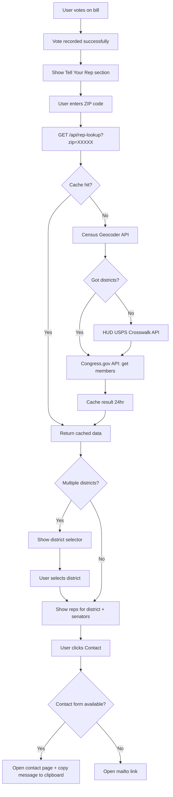

# TeenCivics V1 Features Implementation Plan

> **Date:** 2026-02-08
> **Status:** Ready for implementation
> **Target:** Two new features — Secure Admin Page & Tell Your Rep Email Module

---

## Table of Contents

1. [Codebase Context Summary](#1-codebase-context-summary)
2. [Feature 1: Secure Admin Page](#2-feature-1-secure-admin-page)
3. [Feature 2: Tell Your Rep Email Module](#3-feature-2-tell-your-rep-email-module)
4. [Database Migration Plan](#4-database-migration-plan)
5. [File-by-File Change Manifest](#5-file-by-file-change-manifest)
6. [Implementation Order](#6-implementation-order)
7. [New Dependencies](#7-new-dependencies)

---

## 1. Codebase Context Summary

### Current Architecture

| Layer | Key Files | Notes |
|-------|-----------|-------|
| Web Framework | `app.py` | Flask 3.0, CSRF via Flask-WTF, rate limiting via Flask-Limiter, session cookies configured |
| Database | `src/database/connection.py` | PostgreSQL via psycopg2, ThreadedConnectionPool, context manager `postgres_connect()` |
| DB Operations | `src/database/db.py` | Raw SQL via psycopg2, `db_connect()` context manager, `DictCursor` pattern |
| Config | `src/config.py` | Dataclass-based config loaded from env vars, singleton via `get_config()` |
| Env Loading | `src/load_env.py` | Manual `.env` parser — no dotenv dependency at runtime |
| Templates | `templates/base.html` | Jinja2 extends pattern, ``, nav links, footer |
| CSS | `static/style.css` | CSS custom properties design system — beige/white/brown-black/navy palette, dark mode support |
| JS | `static/script.js` | IIFE module, poll voting via `/api/vote` POST, sponsor reveal after vote, share dropdowns |
| Migrations | `scripts/add_sponsor_columns.py` | Pattern: import `postgres_connect`, check `information_schema.columns`, `ALTER TABLE ... ADD COLUMN IF NOT EXISTS`, verify |

### Current Database Schema (`bills` table)

Columns as defined in `connection.py` `init_db_tables()`:

```
id SERIAL PRIMARY KEY
bill_id TEXT UNIQUE NOT NULL
title TEXT NOT NULL
short_title TEXT
status TEXT
summary_tweet TEXT NOT NULL
summary_long TEXT NOT NULL
summary_overview TEXT
summary_detailed TEXT
term_dictionary TEXT
congress_session TEXT
date_introduced TEXT
date_processed TIMESTAMP NOT NULL
tweet_posted BOOLEAN DEFAULT FALSE
tweet_url TEXT
source_url TEXT NOT NULL
website_slug TEXT
tags TEXT
poll_results_yes INTEGER DEFAULT 0
poll_results_no INTEGER DEFAULT 0
poll_results_unsure INTEGER DEFAULT 0
problematic BOOLEAN DEFAULT FALSE
problem_reason TEXT
sponsor_name TEXT
sponsor_party TEXT
sponsor_state TEXT
created_at TIMESTAMP DEFAULT CURRENT_TIMESTAMP
updated_at TIMESTAMP DEFAULT CURRENT_TIMESTAMP
```

Additional columns exist per migration scripts (not in `init_db_tables`): `full_text`, `text_source`, `text_version`, `text_received_date`, `processing_attempts`, `raw_latest_action`, `tracker_raw`, `normalized_status`, `teen_impact_score`, `text_format`, `fts_vector`.

### Existing Security Infrastructure

- CSRF: `CSRFProtect(app)` — the `/api/vote` endpoint is `@csrf.exempt`
- Rate Limiting: `Flask-Limiter` with default `200/day, 50/hour`; `/api/vote` has `10/min`
- Session: `SECRET_KEY` from env, `SESSION_COOKIE_SECURE`, `SESSION_COOKIE_HTTPONLY`, `SESSION_COOKIE_SAMESITE=Lax`
- Security Headers: `X-Frame-Options`, CSP, `X-Content-Type-Options`, `X-XSS-Protection`, HSTS in prod
- API endpoints set `Cache-Control: no-store`

### Existing API Patterns

Current API routes in `app.py`:
- `POST /api/vote` — JSON body `{bill_id, vote_type, previous_vote}`, returns `{success: true}`
- `GET /api/poll-results/<bill_id>` — returns `{yes_votes, no_votes, unsure_votes, total}`

### Existing Congress.gov API Integration

- `CONGRESS_API_KEY` env var already defined in `.env.example` and loaded in `src/config.py` as `config.congress_api.api_key`
- `src/fetchers/congress_fetcher.py` uses `requests` library with `BASE_URL = "https://api.congress.gov/v3/"`
- Session-based requests with custom headers and user agents

---

## 2. Feature 1: Secure Admin Page

### 2.1 Authentication Approach

**Single-password session authentication** using `ADMIN_PASSWORD` env var.

```
Flow:
1. User navigates to /admin
2. If ADMIN_PASSWORD env var not set → return 404 (feature completely hidden)
3. If not authenticated → redirect to /admin/login
4. Login form accepts password → compare with bcrypt hash of ADMIN_PASSWORD
5. On success → set session["admin_authenticated"] = True
6. Session expires after 2 hours (configurable)
7. Logout clears session
```

**Security details:**
- `ADMIN_PASSWORD` is stored as plaintext in `.env`, but compared via `werkzeug.security.check_password_hash` after hashing on first load or via direct comparison with `hmac.compare_digest` for constant-time comparison
- Since this is a single shared password (not per-user), we use `hmac.compare_digest(password, ADMIN_PASSWORD)` for constant-time string comparison (no need for bcrypt since the secret is in env, not a database)
- Session cookie carries auth state; no separate token needed since Flask sessions are signed with `SECRET_KEY`
- All `/admin/*` routes check `session.get("admin_authenticated")` before proceeding

### 2.2 Rate Limiting for Login

```python
# In app.py or the admin blueprint
@limiter.limit("5 per minute")
@limiter.limit("20 per hour")
def admin_login():
    ...
```

- After 5 failed attempts from an IP within 1 minute, return 429
- After 20 failed attempts within 1 hour, return 429
- Uses existing `Flask-Limiter` infrastructure with `get_remote_address` key function

### 2.3 Route Structure

All admin routes live in a Flask Blueprint registered at `/admin`.

| Route | Method | Auth Required | Purpose |
|-------|--------|---------------|---------|
| `/admin` | GET | Yes | Dashboard — list tables, quick stats |
| `/admin/login` | GET | No | Login form |
| `/admin/login` | POST | No | Process login (rate limited) |
| `/admin/logout` | POST | Yes | Clear session, redirect to /admin/login |
| `/admin/bills` | GET | Yes | Paginated bill listing with search |
| `/admin/bills/<bill_id>` | GET | Yes | Bill detail/edit view |
| `/admin/bills/<bill_id>/summary` | GET | Yes | Dedicated summary editor page |
| `/admin/api/bills` | GET | Yes | JSON: list bills with pagination |
| `/admin/api/bills/<bill_id>` | GET | Yes | JSON: single bill data |
| `/admin/api/bills/<bill_id>` | PUT | Yes | JSON: update bill fields |
| `/admin/api/bills/<bill_id>/summary` | PUT | Yes | JSON: update summary fields specifically |

**Blueprint registration pattern:**

```python
# In app.py
from src.admin.routes import admin_bp

# Only register if ADMIN_PASSWORD is set
if os.environ.get("ADMIN_PASSWORD"):
    app.register_blueprint(admin_bp, url_prefix="/admin")
```

When `ADMIN_PASSWORD` is not set, navigating to `/admin` hits the existing 404 handler — the feature is completely invisible.

### 2.4 Admin Blueprint Module Structure

```
src/admin/
├── __init__.py          # Blueprint definition, auth decorator
├── routes.py            # All route handlers
└── db_operations.py     # Admin-specific DB queries (list, update, audit trail)
```

### 2.5 Auth Decorator

```python
# src/admin/__init__.py
from functools import wraps
from flask import session, redirect, url_for, Blueprint

admin_bp = Blueprint("admin", __name__, template_folder="../../templates/admin")

def admin_required(f):
    @wraps(f)
    def decorated(*args, **kwargs):
        if not session.get("admin_authenticated"):
            return redirect(url_for("admin.login"))
        return f(*args, **kwargs)
    return decorated
```

### 2.6 Database Changes for Admin Audit Trail

Add two columns to the `bills` table:

| Column | Type | Default | Purpose |
|--------|------|---------|---------|
| `last_edited_at` | `TIMESTAMP` | `NULL` | When the bill was last edited via admin |
| `last_edited_by` | `TEXT` | `NULL` | Always `'admin'` for now (future: username) |

These columns are updated whenever an admin edits a bill record via the API.

### 2.7 Template Structure

```
templates/admin/
├── login.html           # Login form (extends base_admin.html)
├── base_admin.html      # Admin layout — simplified nav, no public footer
├── dashboard.html       # Stats overview, recent edits, quick links
├── bills_list.html      # Paginated bill list with search/filter
├── bill_edit.html       # Full bill edit form
└── bill_summary_editor.html  # Dedicated summary editor with side-by-side preview
```

**`base_admin.html`** — Does NOT extend `base.html`. It is a standalone layout:
- Simplified nav: TeenCivics Admin logo, Bills link, Dashboard link, Logout button
- No public footer, no GA, no theme toggle
- Includes admin-specific CSS and JS
- Matches the design system colors: `--color-beige` background, `--color-white` cards, `--color-navy` accents

### 2.8 Admin Dashboard View (`/admin`)

Displays:
- Total bills count
- Bills posted vs unposted count
- Recent edits (from `last_edited_at` column)
- Quick link buttons: "Manage Bills", "View Site"

### 2.9 Bills List View (`/admin/bills`)

Features:
- Paginated table (25 per page)
- Columns: Bill ID, Title (truncated), Status, Teen Impact Score, Posted?, Last Edited
- Search by bill ID or title
- Filter by status dropdown
- Click row to open edit view
- "Edit Summary" quick action button per row

### 2.10 Bill Edit View (`/admin/bills/<bill_id>`)

A form with all editable bill fields grouped into sections:

**Section 1: Core Info**
- `title` (text input)
- `short_title` (text input)
- `status` / `normalized_status` (dropdown)
- `tags` (text input)
- `teen_impact_score` (number input, 0-10)

**Section 2: Summaries** (link to dedicated editor)
- `summary_overview` (textarea)
- `summary_detailed` (textarea)
- `summary_tweet` (textarea with character counter)
- `summary_long` (textarea)
- `term_dictionary` (textarea)

**Section 3: Metadata** (read-only display)
- `bill_id`, `congress_session`, `date_introduced`, `date_processed`, `created_at`, `updated_at`
- `sponsor_name`, `sponsor_party`, `sponsor_state`
- `tweet_posted`, `tweet_url`
- `poll_results_yes`, `poll_results_no`, `poll_results_unsure`

**Section 4: Danger Zone**
- Mark as problematic (toggle + reason textarea)

All edits submit via fetch to `/admin/api/bills/<bill_id>` PUT endpoint.

### 2.11 Bill Summary Editor View (`/admin/bills/<bill_id>/summary`)

A dedicated page for editing summaries with:
- Left panel: editable textareas for `summary_overview`, `summary_detailed`, `summary_tweet`, `summary_long`
- Right panel: live preview rendering the same Jinja filters (`format_detailed_html`) applied via a JS preview function that mimics the formatting
- Character counter for `summary_tweet` (280 char target)
- Auto-save indicator (saves on blur or after 3 seconds of inactivity)
- "Back to Bill" navigation link

### 2.12 Admin API Endpoints

**`GET /admin/api/bills`**
```
Query params: page (default 1), per_page (default 25), q (search), status (filter)
Response: { bills: [...], total: int, page: int, total_pages: int }
```

**`GET /admin/api/bills/<bill_id>`**
```
Response: { bill: { ...all columns... } }
```

**`PUT /admin/api/bills/<bill_id>`**
```
Body: { field1: value1, field2: value2, ... }
Response: { success: true, updated_fields: [...] }
Side effect: sets last_edited_at = NOW(), last_edited_by = 'admin'
```

Only whitelisted fields can be updated:
```python
EDITABLE_FIELDS = {
    'title', 'short_title', 'status', 'normalized_status',
    'summary_overview', 'summary_detailed', 'summary_tweet', 'summary_long',
    'term_dictionary', 'tags', 'teen_impact_score',
    'problematic', 'problem_reason',
    'sponsor_name', 'sponsor_party', 'sponsor_state',
}
```

**`PUT /admin/api/bills/<bill_id>/summary`**
```
Body: { summary_overview, summary_detailed, summary_tweet, summary_long, term_dictionary }
Response: { success: true }
```

### 2.13 Admin CSS

Create `static/admin.css` — reuses CSS custom properties from the design system:

```css
/* Inherits :root variables from style.css */
/* Admin-specific styles only */
.admin-layout { ... }
.admin-sidebar { ... }
.admin-table { ... }
.admin-form { ... }
.admin-editor { ... }
```

### 2.14 Admin JS

Create `static/admin.js`:
- Form submission via fetch (PUT to API endpoints)
- Live preview for summary editor (parses markdown-like formatting client-side)
- Auto-save with debounce
- Success/error toast notifications
- Table sorting and pagination controls
- Search debounce

### 2.15 Security Considerations

1. **CSRF Protection**: Admin form submissions include CSRF tokens (Flask-WTF). Admin API endpoints using PUT method will include CSRF token in headers via JS.
2. **Session Timeout**: Check `session["admin_login_time"]` on each request; expire after 2 hours.
3. **No `@csrf.exempt`**: Unlike the public vote API, admin APIs require CSRF tokens.
4. **Content-Security-Policy**: The existing CSP in `app.py` already restricts scripts. Admin pages will work within existing CSP since they only use `'self'` scripts.
5. **Input Validation**: Server-side field whitelist prevents updating non-editable columns. SQL parameterization prevents injection (existing pattern).
6. **Rate Limiting**: Login endpoint rate limited. API endpoints inherit default limits.

### 2.16 Architecture Diagram

```mermaid
flowchart TD
    A[User visits /admin] --> B{ADMIN_PASSWORD set?}
    B -- No --> C[404 Page]
    B -- Yes --> D{Session authenticated?}
    D -- No --> E[/admin/login form]
    E --> F[POST /admin/login]
    F --> G{Password correct?}
    G -- No --> H[Error + rate limit check]
    H --> E
    G -- Yes --> I[Set session, redirect /admin]
    D -- Yes --> J[Admin Dashboard]
    J --> K[Bills List]
    K --> L[Bill Edit Form]
    L --> M[PUT /admin/api/bills/ID]
    M --> N[Update DB + audit trail]
    K --> O[Summary Editor]
    O --> P[PUT /admin/api/bills/ID/summary]
    P --> N
```

---

## 3. Feature 2: Tell Your Rep Email Module

### 3.1 Integration Point — Post-Vote Flow

The "Tell Your Rep" feature activates **after a user votes** on a bill. Currently, after voting:

1. Vote is recorded via `POST /api/vote` (in `static/script.js` `handleVote()` function)
2. Success message shown ("Thanks for voting!")
3. Results displayed (bars show yes/no percentages)
4. Sponsor info revealed (in `.sponsor-reveal` div)

**New flow after step 4:**

5. A new "Tell Your Rep" button appears below the sponsor reveal section
6. Clicking it opens an inline expandable section (not a new page)
7. User enters their ZIP code
8. System looks up their congressional district and representatives
9. User sees their representatives with "Email" buttons
10. Clicking "Email" opens a mailto link (or contact form URL) with pre-filled subject and body

### 3.2 Component Placement in Templates

In both `templates/index.html` and `templates/bill.html`, add a new div **inside** the `.poll-widget` div, **after** the `.sponsor-reveal` div:

```html
<!-- Tell Your Rep Section - Only visible after voting -->
<div class="tell-your-rep" id="tell-rep-{{ bill.bill_id }}" style="display: none;"
     data-bill-id="{{ bill.bill_id }}" data-bill-title="{{ bill.title }}">
    <h4>Make Your Voice Heard</h4>
    <p class="rep-subtitle">Now that you have voted, tell your representative how you feel about this bill.</p>
    <div class="zip-lookup">
        <label for="zip-input-{{ bill.bill_id }}">Enter your ZIP code:</label>
        <div class="zip-input-group">
            <input type="text" id="zip-input-{{ bill.bill_id }}" 
                   class="zip-input" maxlength="5" pattern="[0-9]{5}"
                   placeholder="e.g. 90210" inputmode="numeric"
                   aria-label="ZIP code for representative lookup">
            <button class="btn btn-primary zip-lookup-btn">Find My Reps</button>
        </div>
    </div>
    <div class="rep-results" style="display: none;">
        <!-- Populated by JS -->
    </div>
    <div class="rep-loading" style="display: none;">
        Looking up your representatives...
    </div>
    <div class="rep-error" style="display: none;"></div>
</div>
```

### 3.3 ZIP-to-District Lookup Strategy

**Primary: Census Geocoder API**

The Census Geocoder can convert a ZIP code to congressional district(s):

```
GET https://geocoding.geo.census.gov/geocoder/geographies/address
    ?street=&city=&state=&zip={ZIP}
    &benchmark=Public_AR_Current
    &vintage=Current_Current
    &format=json
    &layers=54
```

Layer 54 = Congressional Districts (119th Congress).

**Issue:** ZIPs can span multiple districts. The Census API returns geographies for the centroid, which may not cover all districts in a multi-district ZIP.

**Fallback: HUD USPS Crosswalk API**

```
GET https://www.huduser.gov/hudapi/public/usps
    ?type=4&query={ZIP}
```

- Type 4 = ZIP to Congressional District
- Returns all congressional districts that overlap a ZIP
- Requires a free HUD API key (`HUD_API_KEY` env var)

**Lookup Logic:**

```
1. Client sends ZIP to /api/rep-lookup?zip=XXXXX
2. Server checks cache (rep_cache table or in-memory dict)
3. If cache miss:
   a. Call Census Geocoder API → get district(s)
   b. If Census returns 0 districts or error → call HUD API as fallback
   c. For each district, call Congress.gov API for current members
   d. Cache the result for 24 hours
4. Return rep data to client
```

### 3.4 Representative Lookup via Congress.gov API

Using the existing `CONGRESS_API_KEY` and the Congress.gov API v3:

```
GET https://api.congress.gov/v3/member
    ?api_key={KEY}
    &currentMember=true
    &district={DISTRICT_NUMBER}
    &state={STATE_CODE}
    &format=json
```

For Senators (statewide, no district):
```
GET https://api.congress.gov/v3/member
    ?api_key={KEY}
    &currentMember=true
    &state={STATE_CODE}
    &chamber=senate
    &format=json
```

**Data we need per representative:**
- Name (first + last)
- Title (Representative / Senator)
- Party
- State
- District (if House)
- Official website URL (for contact form fallback)
- Photo URL (optional, from Congress.gov)

### 3.5 Multi-District ZIP Handling

When a ZIP spans multiple congressional districts:

1. Show a district selector: "Your ZIP code covers multiple districts. Please select yours:"
2. List the districts with a radio button for each
3. User selects their district
4. Representatives for that district + both state senators are shown

If only one district, skip the selector and show reps directly.

### 3.6 Email Generation

**Primary: mailto link**

Construct a `mailto:` URL with pre-filled subject and body. Since we generally do not have direct congressional email addresses (Congress prefers contact forms), the mailto approach is the fallback.

**Primary for Congress: Contact form URL**

Most representatives prefer constituents use their official contact forms. We provide:

1. **Direct link to contact form** — `https://www.{lastname}.house.gov/contact` or similar, extracted from the member API response (`officialWebsiteUrl`)
2. **Fallback mailto** — If we can detect the email format, use it; otherwise provide a generic mailto with the user's clipboard-ready message

**Email/message content template:**

```
Subject: [Bill ID] - My position on [Short Title]

Dear [Title] [Last Name],

I am a constituent from [ZIP code] writing to express my [support for / opposition to] 
[Bill Title] ([Bill ID]).

[Auto-generated talking points based on bill summary_overview]

As a young constituent, I believe this bill [matters because / concerns me because] 
it affects [extracted tags/topics].

Thank you for your time and service.

Respectfully,
[Name field - optional, user can fill in]
```

The talking points are generated client-side from the bill's summary data already present in the page (no additional API call needed).

### 3.7 API Endpoints

| Route | Method | Purpose |
|-------|--------|---------|
| `/api/rep-lookup` | GET | ZIP → district(s) + representatives |

**`GET /api/rep-lookup?zip=XXXXX`**

```json
// Response when single district
{
  "zip": "90210",
  "state": "CA",
  "districts": [
    {
      "district": "36",
      "representative": {
        "name": "Ted Lieu",
        "party": "D",
        "title": "Representative",
        "website": "https://lieu.house.gov",
        "contact_url": "https://lieu.house.gov/contact",
        "photo_url": "https://..."
      }
    }
  ],
  "senators": [
    {
      "name": "Alex Padilla",
      "party": "D",
      "title": "Senator",
      "website": "https://padilla.senate.gov",
      "contact_url": "https://padilla.senate.gov/contact",
      "photo_url": "https://..."
    },
    {
      "name": "Adam Schiff",
      "party": "D",
      "title": "Senator",
      "website": "https://schiff.senate.gov",
      "contact_url": "https://schiff.senate.gov/contact",
      "photo_url": "https://..."
    }
  ],
  "multi_district": false
}
```

```json
// Response when multiple districts
{
  "zip": "10001",
  "state": "NY",
  "districts": [
    { "district": "10", "representative": { ... } },
    { "district": "12", "representative": { ... } }
  ],
  "senators": [ ... ],
  "multi_district": true
}
```

**Rate limiting:** `10 per minute` per IP (same as vote endpoint).

**CSRF:** This is a GET endpoint returning JSON, so CSRF exempt (read-only).

### 3.8 Caching Strategy

**Server-side in-memory cache with TTL:**

```python
# src/services/rep_cache.py
import time
from typing import Dict, Any, Optional

_cache: Dict[str, Dict[str, Any]] = {}
CACHE_TTL = 86400  # 24 hours in seconds

def get_cached(zip_code: str) -> Optional[Dict]:
    entry = _cache.get(zip_code)
    if entry and time.time() - entry["timestamp"] < CACHE_TTL:
        return entry["data"]
    return None

def set_cached(zip_code: str, data: Dict) -> None:
    _cache[zip_code] = {"data": data, "timestamp": time.time()}
```

This is simple and sufficient for a localhost/single-instance deployment. No Redis needed.

### 3.9 Module Structure

```
src/services/
├── __init__.py
├── rep_lookup.py          # ZIP → district lookup (Census + HUD APIs)
├── rep_cache.py           # In-memory cache with 24hr TTL
└── email_generator.py     # Mailto link and message body construction
```

### 3.10 Frontend JS Integration

Add to `static/script.js` (or a new `static/tell-rep.js` loaded only on bill pages):

**New file recommended: `static/tell-rep.js`**

```javascript
// Tell Your Rep module
// Initializes after poll vote, handles ZIP lookup and email generation
```

Key functions:
- `initTellYourRep()` — Called after vote success to show the "Tell Your Rep" section
- `handleZipLookup(billId, zip)` — Calls `/api/rep-lookup?zip=...`, displays results
- `handleDistrictSelection(district)` — For multi-district ZIPs
- `generateEmailContent(bill, rep, voteType)` — Builds mailto link or clipboard text
- `openContactForm(rep)` — Opens rep's contact page in new tab with message in clipboard

**Integration point in existing `script.js`:**

In the `handleVote()` function's `.then()` success handler (around line 130-135), after `checkAndRevealSponsor(billId)`, add:

```javascript
// Show Tell Your Rep section
showTellYourRep(billId);
```

And add a new function:

```javascript
function showTellYourRep(billId) {
    const repEl = document.getElementById(`tell-rep-${billId}`);
    if (repEl) {
        repEl.style.display = 'block';
    }
}
```

Also check on page load if user already voted (same pattern as sponsor reveal).

### 3.11 CSS for Tell Your Rep

Add to `static/style.css`:

```css
/* Tell Your Rep Section */
.tell-your-rep { ... }
.zip-input-group { ... }
.zip-input { ... }
.rep-card { ... }
.rep-actions { ... }
.district-selector { ... }
```

Design notes:
- Follows existing card pattern (white background, border-radius, shadow)
- Navy accent for the "Find My Reps" button (reuses `.btn-primary`)
- Rep cards show name, title, party as a compact horizontal card
- "Contact" and "Copy Message" buttons per rep
- Mobile responsive: stacks vertically on small screens

### 3.12 Mobile Responsive Considerations

- ZIP input: full width on mobile with large font (16px+ to prevent iOS zoom)
- Rep cards: single column stack on screens < 768px
- Email action buttons: full width on mobile, with adequate touch target (44px+ height)
- District selector radio buttons: large touch targets with surrounding padding
- Loading state: full-width centered spinner/text

### 3.13 Architecture Diagram



---

## 4. Database Migration Plan

### 4.1 Migration Script: `scripts/add_admin_columns.py`

Adds audit trail columns to the `bills` table:

```sql
ALTER TABLE bills
ADD COLUMN IF NOT EXISTS last_edited_at TIMESTAMP,
ADD COLUMN IF NOT EXISTS last_edited_by TEXT;
```

**Pattern:** Follows the exact same pattern as `scripts/add_sponsor_columns.py`:
1. Import `postgres_connect` from `src.database.connection`
2. Check `information_schema.columns` for existing columns
3. `ALTER TABLE ... ADD COLUMN IF NOT EXISTS`
4. Verify with a follow-up query
5. Log success/failure with emoji indicators

### 4.2 Schema Update in `connection.py`

Also update `init_db_tables()` in `src/database/connection.py` to include the new columns in the `CREATE TABLE IF NOT EXISTS` statement so new installations get them automatically:

```sql
-- Add inside the CREATE TABLE IF NOT EXISTS bills block:
last_edited_at TIMESTAMP,
last_edited_by TEXT,
```

### 4.3 No New Tables Required

- Rep lookup cache is in-memory (no database table needed for V1)
- Admin auth uses Flask sessions (server-side signed cookies, no table needed)
- No `admin_users` table needed since this is a single shared password

---

## 5. File-by-File Change Manifest

### New Files to Create

| File | Purpose |
|------|---------|
| `src/admin/__init__.py` | Admin Blueprint definition, `admin_required` decorator |
| `src/admin/routes.py` | All admin route handlers |
| `src/admin/db_operations.py` | Admin DB queries (list bills paginated, update bill, audit trail) |
| `src/services/__init__.py` | Services package init |
| `src/services/rep_lookup.py` | ZIP → district → representative lookup logic |
| `src/services/rep_cache.py` | In-memory cache with 24hr TTL |
| `src/services/email_generator.py` | Email subject/body template generation |
| `templates/admin/base_admin.html` | Admin layout template |
| `templates/admin/login.html` | Admin login page |
| `templates/admin/dashboard.html` | Admin dashboard |
| `templates/admin/bills_list.html` | Admin bills listing |
| `templates/admin/bill_edit.html` | Admin bill edit form |
| `templates/admin/bill_summary_editor.html` | Dedicated summary editor with preview |
| `static/admin.css` | Admin-specific styles |
| `static/admin.js` | Admin-specific JavaScript |
| `static/tell-rep.js` | Tell Your Rep frontend module |
| `scripts/add_admin_columns.py` | Migration: add `last_edited_at`, `last_edited_by` columns |

### Existing Files to Modify

| File | Changes |
|------|---------|
| `app.py` | Register admin blueprint (conditional on `ADMIN_PASSWORD`), register `/api/rep-lookup` route, import rep_lookup service |
| `src/config.py` | Add `AdminConfig` dataclass with `password` field; add `HudConfig` dataclass with `api_key` field |
| `src/database/connection.py` | Add `last_edited_at` and `last_edited_by` to `CREATE TABLE` in `init_db_tables()` |
| `src/database/db.py` | Add `update_bill_admin()` function that sets `last_edited_at`/`last_edited_by`; add `get_all_bills_paginated()` for admin list |
| `src/database/db_utils.py` | Re-export new DB functions |
| `templates/bill.html` | Add Tell Your Rep section HTML after `.sponsor-reveal` div |
| `templates/index.html` | Add Tell Your Rep section HTML after `.sponsor-reveal` div |
| `templates/base.html` | No changes needed — admin uses its own base template |
| `static/script.js` | Add `showTellYourRep()` function, call it after vote success, check on page load for returning voters |
| `static/style.css` | Add Tell Your Rep component styles (ZIP input, rep cards, district selector) |
| `.env.example` | Add `ADMIN_PASSWORD`, `HUD_API_KEY` entries |
| `requirements.txt` | No new packages needed — all APIs use existing `requests` library |

---

## 6. Implementation Order

Implementation should proceed in this dependency order:

### Phase 1: Database Migration + Config Updates
1. Update `src/config.py` — add `AdminConfig` and `HudConfig` dataclasses
2. Update `.env.example` — add new env var entries
3. Create `scripts/add_admin_columns.py` — migration script
4. Run migration script
5. Update `src/database/connection.py` — add new columns to `CREATE TABLE`

### Phase 2: Admin Page (Feature 1)
6. Create `src/admin/__init__.py` — Blueprint + auth decorator
7. Create `src/admin/db_operations.py` — admin DB query functions
8. Create `src/admin/routes.py` — all admin routes
9. Create `templates/admin/base_admin.html` — admin layout
10. Create `templates/admin/login.html` — login page
11. Create `templates/admin/dashboard.html` — dashboard
12. Create `templates/admin/bills_list.html` — bill listing
13. Create `templates/admin/bill_edit.html` — bill edit form
14. Create `templates/admin/bill_summary_editor.html` — summary editor
15. Create `static/admin.css` — admin styles
16. Create `static/admin.js` — admin frontend logic
17. Update `app.py` — register admin blueprint
18. Update `src/database/db.py` — add admin query functions
19. Update `src/database/db_utils.py` — re-export new functions

### Phase 3: Tell Your Rep (Feature 2)
20. Create `src/services/__init__.py` — services package
21. Create `src/services/rep_cache.py` — caching layer
22. Create `src/services/rep_lookup.py` — ZIP/district/rep lookup
23. Create `src/services/email_generator.py` — email content builder
24. Create `static/tell-rep.js` — frontend module
25. Update `templates/bill.html` — add Tell Your Rep HTML section
26. Update `templates/index.html` — add Tell Your Rep HTML section
27. Update `static/script.js` — add `showTellYourRep()`, integrate with vote flow
28. Update `static/style.css` — add Tell Your Rep styles
29. Update `app.py` — add `/api/rep-lookup` route

### Phase 4: Final Integration
30. Update `.env.example` with all new variables
31. Test admin login flow end-to-end
32. Test Tell Your Rep flow end-to-end
33. Verify existing functionality is unaffected

---

## 7. New Dependencies

**No new pip packages are required.**

All external API calls use the existing `requests` library (already in `requirements.txt`). The admin page uses Flask sessions and Flask-WTF CSRF (both already installed). The in-memory cache requires no additional packages.

Current relevant dependencies already present:
- `Flask==3.0.0` — web framework, sessions, blueprints
- `Flask-Limiter==3.5.0` — rate limiting
- `Flask-WTF==1.2.1` — CSRF protection
- `requests==2.31.0` — HTTP requests to Census, HUD, Congress.gov APIs
- `psycopg2-binary==2.9.10` — PostgreSQL access

**New environment variables needed:**

| Variable | Required | Purpose |
|----------|----------|---------|
| `ADMIN_PASSWORD` | No (feature disabled if unset) | Admin page authentication password |
| `HUD_API_KEY` | No (fallback disabled) | HUD USPS Crosswalk API key for multi-district ZIP lookup |

The `CONGRESS_API_KEY` is already defined and used — the Tell Your Rep feature reuses it for member lookups.
